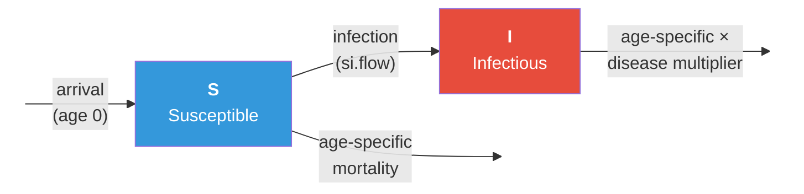

# SI Model with Age-Specific Vital Dynamics

## Description

This example demonstrates how to model an SI epidemic on a dynamic network with **vital dynamics** — aging, births (arrivals), and deaths (departures). In most real-world settings, populations are open: individuals are born, age, and die over the course of an epidemic. These demographic processes shape disease dynamics by continuously introducing new susceptibles (via births) and removing individuals (via death).

The key extension here is **age-specific mortality** using real US mortality data, combined with **disease-induced excess mortality** where infected individuals face a higher death rate. The network model also includes age-assortative mixing, so partnerships form preferentially between individuals close in age.

This is the foundational vital dynamics example in the Gallery. The three custom modules (aging, departures, arrivals) are building blocks reused and extended in many other examples.

## Model Structure

### Disease Compartments

| Compartment | Label | Description |
|-------------|-------|-------------|
| Susceptible | **S** | Not infected; at risk of infection through contact |
| Infectious | **I** | Infected and capable of transmitting (no recovery in SI) |

### Flow Diagram



### Vital Dynamics

Three custom modules implement the demographic processes:

1. **Aging**: Each timestep represents one week. All nodes age by 1/52 years per step. This continuous aging interacts with the network model (partnerships respect age similarity) and the departure model (mortality rates depend on age).

2. **Departures (mortality)**: Each active node faces an age-specific weekly mortality probability drawn from US life table data. The 86-element rate vector maps ages 0–85+ to mortality probabilities. Infected individuals have their rate multiplied by `departure.disease.mult`, representing disease-induced excess mortality.

3. **Arrivals (births)**: New nodes enter the population as susceptible individuals at age 0. The arrival rate is calibrated to the mean departure rate, so the population size is approximately stable when disease-induced mortality is absent.

### Age-Specific Mortality

Mortality rates are derived from US population data (source: [Statista](https://www.statista.com/statistics/241572/death-rate-by-age-and-sex-in-the-us/)). Rates are reported per 100,000 per year for 19 age groups and converted to per-person-per-week probabilities. The age-to-index mapping uses `ceiling(age)` to convert continuous age to a vector position, capped at 86 for ages 85+.

### Network Model

The formation model uses two ERGM terms:

- **`edges`**: Controls the mean degree (average number of concurrent partnerships per node). With a target of 200 edges in a 500-node network, the mean degree is 0.8.
- **`absdiff("age")`**: Controls age-assortative mixing. The target statistic is the sum of absolute age differences across all edges. A lower value per edge (1.5 years) means partners tend to be close in age.

The dissolution model uses `dissolution_coefs()` with a `d.rate` argument to adjust for population turnover — without this correction, the observed partnership duration would be shorter than intended because partnerships with departed nodes end prematurely.

Because ages change each timestep, the network must be resimulated at each step (`resimulate.network = TRUE`) so the formation model respects the updated age distribution.

## Modules

### Aging Module (`aging`)

Increments each node's age by 1/52 per timestep (one week). Records the population mean age as an epidemiological summary statistic (`meanAge`).

### Departure Module (`dfunc`)

Simulates age-specific mortality. For each active node, looks up the weekly departure probability from the 86-element rate vector using the node's current age. For infected nodes, multiplies the rate by `departure.disease.mult`. Departed nodes are marked `active = 0` with their `exitTime` recorded.

### Arrival Module (`afunc`)

Simulates births using a Poisson process scaled by population size. New nodes enter with `status = "s"`, `age = 0`, and `infTime = NA`. Uses `append_core_attr()` and `append_attr()` to add new nodes to the simulation.

### Infection Module (`infection.net`)

Uses EpiModel's built-in SI infection module. No custom modification is needed because the core transmission process (discordant edgelist, per-act probability) is unchanged.

## Parameters

### Transmission

| Parameter | Description | Default |
|-----------|-------------|---------|
| `inf.prob` | Per-act transmission probability | 0.15 |
| `act.rate` | Acts per partnership per week (built-in default) | 1 |

### Vital Dynamics

| Parameter | Description | Default |
|-----------|-------------|---------|
| `departure.rates` | Age-specific weekly mortality rates (86-element vector) | US life table data |
| `departure.disease.mult` | Multiplier on departure rates for infected individuals | 1 (baseline) or 50 (lethal) |
| `arrival.rate` | Per-capita weekly birth rate | `mean(departure.rates)` |

### Network

| Parameter | Description | Default |
|-----------|-------------|---------|
| Population size | Number of nodes | 500 |
| Mean degree | Average concurrent partnerships per node | 0.8 |
| Age assortativity | Mean absolute age difference within partnerships | 1.5 years |
| Partnership duration | Mean edge duration (weeks) | 60 (~1.2 years) |

## Module Execution Order

```
aging → departures (dfunc) → arrivals (afunc) → resim_nets → infection → prevalence
```

Aging runs first so that departure rates reflect updated ages. Arrivals follow departures to replace the departed. Network resimulation happens after demographic changes so the ERGM respects the new population composition. Infection then runs on the updated network.

## Next Steps

- **Add disease recovery** to convert this SI model to an SIS or SIR model — see [Adding an Exposed State](../2018-08-AddingAnExposedState) for the progression module pattern
- **Use more granular age categories** or empirical life table data for country-specific mortality
- **Add heterogeneous susceptibility** that varies by age (e.g., younger individuals more susceptible)
- **Incorporate age-dependent partnership formation** using additional ERGM terms beyond `absdiff`
- **Add stage-dependent infectiousness and mortality** — see the [HIV model](../2019-03-HIV) for disease stage–specific departure rates

## Author

Samuel M. Jenness, Emory University (http://samueljenness.org/)
