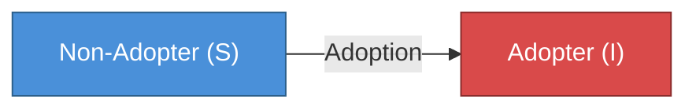
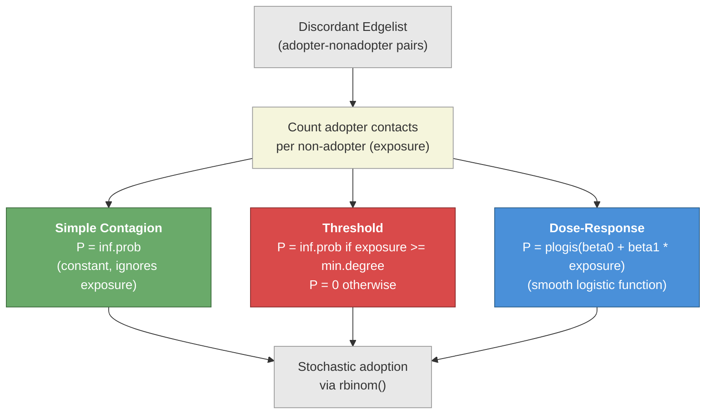

# Social Diffusion Model

## Authors
Samuel M. Jenness (Emory University)

## Description

This example demonstrates how EpiModel's SI (susceptible-infected) framework can be repurposed to model **social diffusion** -- the spread of ideas, behaviors, or technologies through a social network. Unlike infectious disease, social diffusion often exhibits **complex contagion**: adoption requires reinforcement from multiple contacts, not just exposure to a single carrier.

The model compares three diffusion mechanisms on the same network:

1. **Simple contagion** (baseline): constant per-contact adoption probability, using EpiModel's built-in SI model. Equivalent to standard infectious disease transmission.
2. **Threshold diffusion**: adoption only occurs when a non-adopter has at least a minimum number of adopter contacts. Below this threshold, adoption probability is exactly 0.
3. **Dose-response diffusion**: adoption probability is a smooth logistic function of the number of adopter contacts. More exposure increases probability, but with no hard cutoff.

### Simple vs. Complex Contagion

In **simple contagion** (standard epidemic models), a single infected contact is sufficient to transmit. The per-contact transmission probability is constant regardless of how many other infected contacts exist. This works well for biological pathogens, where a single exposure event can cause infection.

**Complex contagion** (Centola & Macy, 2007) describes processes where adoption requires social reinforcement from multiple sources. A person might resist changing behavior after seeing one friend adopt, but change after seeing three friends adopt. This captures:

- **Technology adoption**: "I'll switch to a new platform only if enough friends already use it"
- **Behavior change**: "I need multiple role models before I change my habits"
- **Collective action**: "I'll join the protest only if enough peers are committed"
- **Norm diffusion**: "I'll adopt a new norm only when it's clearly the local standard"

The key insight from this model: **the same network and same initial conditions produce dramatically different dynamics depending on the diffusion mechanism**. Complex contagion is slower to start but can produce sudden "tipping point" cascades once enough of the network is seeded.

## Model Structure

### Diffusion Flow

```mermaid
graph LR
    S["Non-Adopter (S)"] -->|"Adoption"| I["Adopter (I)"]

    style S fill:#4a90d9,stroke:#2c5f8a,color:#fff
    style I fill:#d94a4a,stroke:#8a2c2c,color:#fff
```

Adoption is permanent (SI dynamics -- no reversion to non-adopter status). The three scenarios differ only in how adoption probability is calculated.

### Adoption Probability by Mechanism

```mermaid
graph TD
    DEL["Discordant Edgelist<br/>(adopter-nonadopter pairs)"] --> COUNT["Count adopter contacts<br/>per non-adopter (exposure)"]

    COUNT --> S1["<b>Simple Contagion</b><br/>P = inf.prob<br/>(constant, ignores exposure)"]
    COUNT --> S2["<b>Threshold</b><br/>P = inf.prob if exposure >= min.degree<br/>P = 0 otherwise"]
    COUNT --> S3["<b>Dose-Response</b><br/>P = plogis(beta0 + beta1 * exposure)<br/>(smooth logistic function)"]

    S1 --> ADOPT["Stochastic adoption<br/>via rbinom()"]
    S2 --> ADOPT
    S3 --> ADOPT

    style DEL fill:#e8e8e8,stroke:#999
    style COUNT fill:#f5f5dc,stroke:#999
    style S1 fill:#6aaa6a,stroke:#3d6b3d,color:#fff
    style S2 fill:#d94a4a,stroke:#8a2c2c,color:#fff
    style S3 fill:#4a90d9,stroke:#2c5f8a,color:#fff
    style ADOPT fill:#e8e8e8,stroke:#999
```

### Dose-Response Probability Curve

The logistic dose-response function with `beta0 = -5.0` and `beta1 = 1.5` produces these adoption probabilities per act:

| Adopter Contacts | Log-Odds | P(adopt per act) |
|:---:|:---:|:---:|
| 0 | -5.0 | 0.007 |
| 1 | -3.5 | 0.029 |
| 2 | -2.0 | 0.119 |
| 3 | -0.5 | 0.378 |
| 4 | +1.0 | 0.731 |

Compare: simple contagion uses a constant P = 0.1 regardless of exposure; the threshold model uses P = 0.5 when exposure >= 2 and P = 0 otherwise.

## Modules

### `diffuse_threshold` (Threshold Diffusion)

Replaces EpiModel's built-in infection module. Key differences from standard SI transmission:

1. Counts the **exposure** for each non-adopter: the number of current partners who have already adopted. This is computed by aggregating the discordant edgelist (DEL) -- each row in the DEL represents one adopter-nonadopter partnership, so the count of rows per non-adopter gives the exposure count.
2. Applies a **hard threshold rule**: adoption probability is `inf.prob` per act only when exposure >= `min.degree`. Below the threshold, adoption probability is exactly 0.
3. Uses the standard EpiModel stochastic framework: `finalProb = 1 - (1 - transProb)^actRate`, then `rbinom()` for adoption.

### `diffuse_dose_response` (Dose-Response Diffusion)

Same structure as the threshold module, but with a **smooth logistic** adoption probability:

1. Same exposure counting via DEL aggregation.
2. Adoption probability per act: `plogis(beta0 + beta1 * exposure)`. No hard cutoff -- even exposure = 0 has a small nonzero probability (controlled by `beta0`).
3. Same stochastic framework as above.

## Parameters

### Network Parameters

| Parameter | Value | Description |
|---|:---:|---|
| Network size | 500 | Total nodes in the social network |
| `edges` target | 600 | Mean degree = 2.4 |
| `isolates` target | 20 | 4% of nodes have no connections |
| Partnership duration | 50 | Average time steps per social tie |

### Scenario Parameters

| Parameter | Simple | Threshold | Dose-Response | Description |
|---|:---:|:---:|:---:|---|
| `inf.prob` | 0.1 | 0.5 | -- | Per-act adoption probability |
| `act.rate` | 1 | 1 | 1 | Acts per partnership per time step |
| `min.degree` | -- | 2 | -- | Minimum adopter contacts required |
| `beta0` | -- | -- | -5.0 | Log-odds intercept |
| `beta1` | -- | -- | 1.5 | Log-odds slope per adopter contact |
| Initial adopters | 50 | 50 | 50 | Seed prevalence = 10% |

## Expected Results

The three scenarios produce qualitatively different diffusion dynamics on the same network:

- **Simple contagion**: fastest initial spread, producing a classic smooth S-shaped adoption curve. Reaches near-complete adoption quickly because every adopter-nonadopter contact has a 10% chance of causing adoption per act. Time to 50% adoption: ~15 time steps.

- **Threshold diffusion (min = 2)**: dramatically delayed onset. Requiring 2 adopter contacts means diffusion cannot begin until local clusters of adoption form. On a stable network (duration = 50), non-adopters keep the same contacts for long periods, so meeting the threshold requires either network turnover or cascading adoption from neighbors. Once critical mass is reached, diffusion accelerates as each new adopter helps push their neighbors over the threshold. Time to 50% adoption: ~50-70 time steps (~4x slower than simple contagion). Notably, the threshold model's per-act probability (0.5) is 5x higher than simple contagion's (0.1), yet diffusion is still much slower -- demonstrating that the mechanism matters more than the probability.

- **Dose-response**: intermediate speed. With a single adopter contact, the probability is very low (0.029), so diffusion requires some social reinforcement. But unlike the threshold model, there is no hard cutoff -- even isolated exposure can (rarely) cause adoption. As prevalence rises and non-adopters accumulate more adopter contacts, the logistic function accelerates adoption. Time to 50% adoption: ~30-35 time steps.

The key pedagogical takeaway: **network structure interacts with the diffusion mechanism**. The same well-connected network that supports rapid simple contagion produces dramatically slower complex contagion -- not because the network is "bad," but because the threshold requirement creates a bottleneck until enough local clustering develops. Longer partnership durations amplify this effect by reducing network turnover. This has implications for intervention design: seeding adoption in highly connected clusters is much more important for complex contagion than for simple contagion.

## References

- Centola D, Macy M. Complex Contagions and the Weakness of Long Ties. *American Journal of Sociology*. 2007;113(3):702-734.
- Guilbeault D, Becker J, Centola D. Complex Contagions: A Decade in Review. In: Lehmann S, Ahn YY, eds. *Complex Spreading Phenomena in Social Systems*. Springer; 2018:3-25.
