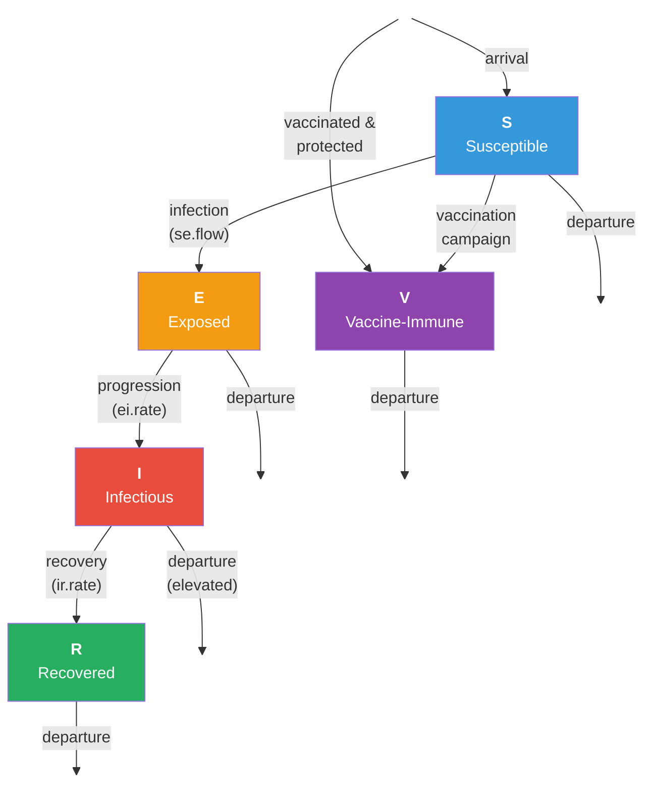

# SEIR Model with All-or-Nothing Vaccination and Vital Dynamics

## Description

This example demonstrates how to model an **all-or-nothing (AON) vaccination** intervention on an SEIR epidemic over a dynamic network with vital dynamics (births and deaths). In an AON vaccine model, vaccinated individuals are either **fully immune** or **completely unprotected** — there is no partial protection. This is a reasonable approximation for vaccines where the immune response is binary: either sterilizing immunity is achieved or not.

The key extension is a **vaccination cascade** operating through three routes: initial population coverage, ongoing vaccination campaigns, and newborn vaccination. Protected individuals are moved to a separate "V" (vaccine-immune) compartment and cannot be infected. This creates a growing immune population that reduces transmission through **herd immunity** effects — even unvaccinated susceptibles benefit as the infectious pool shrinks.

This example introduces several important EpiModel techniques: adding custom node attributes for vaccination/protection status, implementing a separate initialization module, modeling vaccination at multiple population entry points, and comparing disease dynamics with and without intervention.

## Model Structure

### Disease Compartments

| Compartment | Label | Description |
|-------------|-------|-------------|
| Susceptible | **S** | Not infected; at risk of infection |
| Exposed | **E** | Infected but not yet infectious (latent period) |
| Infectious | **I** | Infected and capable of transmitting |
| Recovered | **R** | Recovered with permanent natural immunity |
| Vaccine-Immune | **V** | Protected by AON vaccination; completely immune |

### Flow Diagram



### All-or-Nothing Vaccination Mechanism

The AON vaccine works in two steps:

1. **Vaccination**: An individual receives the vaccine (tracked by the `vaccination` attribute: "initial", "progress", or "arrival" depending on the route).
2. **Protection**: A vaccinated susceptible individual has a probability of receiving protection. If protected, they are moved to `status = "v"` and become completely immune. If not protected, they remain susceptible with `protection = "none"` and cannot be re-vaccinated.

Key assumptions:
- **Binary immunity**: Protected individuals have 100% immunity (cannot be infected). Unprotected individuals have 0% benefit.
- **One-shot vaccination**: Individuals can only be vaccinated once. Those who fail to receive protection on their first vaccination do not get a second chance.
- **No waning**: Vaccine immunity is permanent (SEIR, not SEIRS). Protected individuals remain in the V compartment indefinitely.

### Vaccination Routes

| Route | When | Rate Parameters |
|-------|------|----------------|
| Initialization | Timestep 2 only | `vaccination.rate.initialization`, `protection.rate.initialization` |
| Progression | Every timestep | `vaccination.rate.progression`, `protection.rate.progression` |
| Arrivals | At birth | `vaccination.rate.arrivals`, `protection.rate.arrivals` |

The effective per-route protection rate is `vaccination.rate × protection.rate`. For example, with `vaccination.rate.arrivals = 0.6` and `protection.rate.arrivals = 0.8`, 48% of newborns become vaccine-immune.

## Network Model

Simple edges-only formation model:

- **`edges`** (target: 200): Mean degree 0.8 in a 500-node network
- Partnership duration: 50 weeks (~1 year)
- `d.rate` in `dissolution_coefs` adjusts for population turnover
- `resimulate.network = TRUE` because population size changes with vital dynamics

## Modules

### Vaccine Attribute Initialization (`init_vaccine_attrs`)

Runs once at the first module call (detected via `override.null.error`). Initializes `vaccination` and `protection` attributes for all nodes. Stochastic vaccination of the initial population with protection conditional on susceptible status.

### Infection Module (`infect`)

Standard S → E transmission along discordant edges. Protected individuals (`status = "v"`) are automatically excluded from the susceptible pool by `discord_edgelist()`, which only considers `status = "s"` as susceptible. This is the mechanism by which AON vaccination prevents infection — no special logic needed in the infection module itself.

### Disease Progression Module (`progress`)

Simulates E → I (at `ei.rate`) and I → R (at `ir.rate`). No R → S transition — this is an SEIR model with permanent natural immunity.

### Departure Module (`dfunc`)

Simulates mortality with disease-induced excess. All nodes face `departure.rate`; infected individuals face `departure.rate × departure.disease.mult`.

### Arrival Module (`afunc`)

Simulates births and ongoing vaccination each timestep. Two processes:
1. **Progression**: Unvaccinated active nodes may be vaccinated, with protection for vaccinated susceptibles
2. **Arrivals**: New nodes enter as susceptible, may be vaccinated at birth

After all vaccination processing, susceptible nodes with protection are moved to `status = "v"`.

## Parameters

### Transmission

| Parameter | Description | Default |
|-----------|-------------|---------|
| `inf.prob` | Per-act transmission probability | 0.5 |
| `act.rate` | Acts per partnership per week | 1 |

### Disease Progression

| Parameter | Description | Default |
|-----------|-------------|---------|
| `ei.rate` | E → I rate (mean latent ~20 weeks) | 0.05 |
| `ir.rate` | I → R rate (mean infectious ~20 weeks) | 0.05 |

### Vital Dynamics

| Parameter | Description | Default |
|-----------|-------------|---------|
| `departure.rate` | Baseline weekly mortality rate | 0.008 |
| `departure.disease.mult` | Mortality multiplier for infected | 2 |
| `arrival.rate` | Per-capita weekly birth rate | 0.01 |

### Vaccination (All-or-Nothing)

| Parameter | Description | No Vax | Strong Vax |
|-----------|-------------|--------|------------|
| `vaccination.rate.initialization` | Initial population vaccination rate | 0 | 0.05 |
| `protection.rate.initialization` | Protection rate for initial vaccinees | 0 | 0.8 |
| `vaccination.rate.progression` | Weekly campaign vaccination rate | 0 | 0.05 |
| `protection.rate.progression` | Protection rate for campaign vaccinees | 0 | 0.8 |
| `vaccination.rate.arrivals` | Newborn vaccination rate | 0 | 0.6 |
| `protection.rate.arrivals` | Protection rate for vaccinated newborns | 0 | 0.8 |

### Network

| Parameter | Description | Default |
|-----------|-------------|---------|
| Population size | Number of nodes | 500 |
| Mean degree | Average concurrent partnerships | 0.8 |
| Partnership duration | Mean edge duration (weeks) | 50 |

## Module Execution Order

```
resim_nets → initAttr → departures → arrivals → infection → progress → prevalence
```

Departures and arrivals run before infection so the network reflects the current population when transmission is simulated. The `initAttr` module only operates at the first timestep.

## Scenarios

| Scenario | Vaccination | Expected Outcome |
|----------|-------------|-----------------|
| No vaccination | All rates = 0 | SEIR epidemic limited only by natural immunity and turnover |
| Strong AON | High rates (see table) | Growing V compartment suppresses epidemic via herd immunity |

## Next Steps

- **Add waning vaccine immunity** to convert V → S, making vaccine protection temporary (SEIR-V with waning)
- **Compare with leaky vaccination** — see [SEIRS with Leaky Vaccination](../2018-12-SEIRSwithLeakyVax) for the alternative vaccine model where protection reduces but does not eliminate transmission
- **Add booster doses** by allowing re-vaccination of individuals whose protection has waned
- **Implement age-targeted vaccination** by combining with age attributes — see [SI with Vital Dynamics](../2018-08-SIwithVitalDynamics) for the age module pattern
- **Model vaccine hesitancy** by making vaccination rates heterogeneous across individuals or network neighborhoods
- **Add cost-effectiveness analysis** to evaluate the vaccination program's efficiency — see [Cost-Effectiveness Analysis](../2021-10-CostEffectivenessAnalysis)

## Author

Connor M. Van Meter, Emory University
