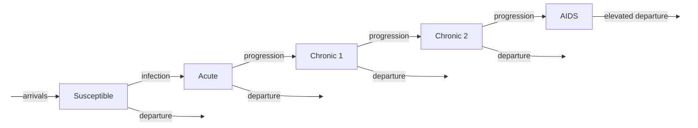

# HIV Transmission Model

## Description

This example implements a simplified HIV transmission model over a dynamic
network, based on the deterministic compartmental framework from
[Granich et al. (2009)](https://www.thelancet.com/journals/lancet/article/PIIS0140-6736(08)61697-9/fulltext).
The model extends EpiModel's built-in SI framework with four distinct
infectious sub-compartments and an antiretroviral therapy (ART) intervention.


## Model Structure

### Disease Compartments

Disease progression is unidirectional: **S → Acute → Chronic 1 → Chronic 2 → AIDS**.

| Compartment | Description |
|-------------|-------------|
| **S** (Susceptible) | Not infected with HIV |
| **Acute** | Recently infected; high viral load produces elevated infectiousness |
| **Chronic 1** | Early chronic infection; low infectiousness, stable CD4+ count |
| **Chronic 2** | Late chronic infection; low infectiousness, declining CD4+ count |
| **AIDS** | Advanced disease; rising viral load increases infectiousness, elevated mortality |

### ART Treatment Layer

Each infectious compartment has two sub-states: **on ART** and **not on ART**.
Individuals not on ART may stochastically begin treatment at each timestep;
those on ART may stochastically discontinue. ART has two effects:

1. **Reduced infectiousness**: transmission probability is scaled by
   `relative.inf.prob.ART` (default 0.05, a 95% reduction)
2. **Slower progression**: stage transition rates are scaled by
   `ART.Progression.Reduction.Rate` (default 0.5, halving the rate)

### Vital Dynamics

- **Arrivals**: new susceptible individuals enter proportional to network size
- **Departures**: background mortality applies to all individuals; persons with
  AIDS depart at an elevated disease-induced rate (further reduced by ART)

### Model Flow Diagram



Within each infected compartment, individuals move between on-ART and
off-ART sub-states via stochastic treatment initiation and discontinuance.


## Transmission Probability

Transmission probability follows a multiplicative structure:

```
P(transmit per act) = inf.prob.chronic × stage_multiplier × ART_multiplier
```

| Infector Stage | `stage_multiplier` | Default |
|---|---|---|
| Acute | `relative.inf.prob.acute` | 10× |
| Chronic 1 or 2 | 1 (reference) | 1× |
| AIDS | `relative.inf.prob.AIDS` | 5× |

| Infector ART Status | `ART_multiplier` | Default |
|---|---|---|
| Not on ART | 1 | 1× |
| On ART | `relative.inf.prob.ART` | 0.05× |

This per-act probability is then converted to a per-timestep probability
accounting for the number of acts per partnership:
`finalProb = 1 - (1 - transProb)^act.rate`.


## Modules

### Infection Module (`infect`)

Simulates HIV transmission from infected to susceptible individuals on
discordant edges. Transmission probability depends on the infector's disease
stage and ART status (see table above). Newly infected individuals enter the
acute stage with no ART.

### Progression Module (`progress`)

Handles two processes:

1. **ART dynamics**: infected individuals not on ART may stochastically begin
   treatment; those on ART may stochastically discontinue. Both use a
   one-timestep delay (`ART.time != 0`) to prevent immediate reversal.

2. **Stage transitions**: individuals progress through the four disease stages
   at rates that depend on ART status. ART reduces all progression rates by
   `ART.Progression.Reduction.Rate`. A one-timestep delay (`stage.time != 0`)
   prevents double-transitions within a single step.

Time counters (`stage.time` and `ART.time`) are incremented at the start of
each call, then reset to 0 when a transition occurs.

### Departure Module (`dfunc`)

Two departure processes:

- **Standard departure**: all susceptible and non-AIDS infected individuals
  depart at the background `departure.rate`
- **AIDS departure**: individuals with AIDS depart at the elevated
  `AIDSToDepart.Rate`, reduced by `ART.Progression.Reduction.Rate` for those
  on ART

### Arrival Module (`afunc`)

New individuals arrive as susceptible at a rate proportional to network size.
Uses `append_core_attr()` for EpiModel 2.x-compatible attribute management.


## Parameters

### Transmission

| Parameter | Description | Default |
|-----------|-------------|---------|
| `inf.prob.chronic` | Per-act transmission probability for chronic-stage HIV | 0.01 |
| `relative.inf.prob.acute` | Multiplier for acute-stage infectiousness | 10 |
| `relative.inf.prob.AIDS` | Multiplier for AIDS-stage infectiousness | 5 |
| `relative.inf.prob.ART` | Multiplier for infectiousness while on ART | 0.05 |
| `act.rate` | Number of acts per partnership per timestep | 4 |

### Disease Progression

| Parameter | Description | Default |
|-----------|-------------|---------|
| `AcuteToChronic1.Rate` | Per-timestep probability of acute → chronic 1 | 1/12 |
| `Chronic1ToChronic2.Rate` | Per-timestep probability of chronic 1 → chronic 2 | 1/260 |
| `Chronic2ToAIDS.Rate` | Per-timestep probability of chronic 2 → AIDS | 1/260 |

### ART Treatment

| Parameter | Description | Default |
|-----------|-------------|---------|
| `ART.Treatment.Rate` | Per-timestep probability of starting ART | 0.01 |
| `ART.Discontinuance.Rate` | Per-timestep probability of stopping ART | 0.005 |
| `ART.Progression.Reduction.Rate` | Multiplier applied to progression and AIDS departure rates while on ART | 0.5 |

### Vital Dynamics

| Parameter | Description | Default |
|-----------|-------------|---------|
| `arrival.rate` | Per-capita arrival rate per timestep | 0.002 |
| `departure.rate` | Background per-capita departure rate per timestep | 0.003 |
| `AIDSToDepart.Rate` | Per-timestep departure probability for persons with AIDS | 1/104 |


## Module Execution Order

```
resim_nets → progress → infect → departures → arrivals → prevalence
```

Progression runs before infection so that disease stage and ART status are
updated before transmission probabilities are computed.


## Next Steps

Good next steps for this example might be:

- Add heterogeneous ART adherence or a continuum-of-care cascade (testing, linkage, retention)
- Model PrEP as a prevention intervention alongside ART-as-prevention
- Add demographic heterogeneity (e.g., age, sex, or risk group) with differential network formation
- Calibrate parameters to an empirical setting using observed HIV prevalence and ART coverage data

## Authors

Samuel M. Jenness, Connor Van Meter, Yuan Zhao, Emeli Anderson


## References

- Granich RM, Gilks CF, Dye C, De Cock KM, Williams BG. Universal voluntary
  HIV testing with immediate antiretroviral therapy as a strategy for
  elimination of HIV transmission: a mathematical model. *The Lancet*.
  2009;373(9657):48-57.
  [doi:10.1016/S0140-6736(08)61697-9](https://doi.org/10.1016/S0140-6736(08)61697-9)

- Jenness SM, Goodreau SM, Morris M. EpiModel: An R Package for Mathematical
  Modeling of Infectious Disease over Networks. *Journal of Statistical
  Software*. 2018;84(8):1-47.
  [doi:10.18637/jss.v084.i08](https://doi.org/10.18637/jss.v084.i08)
