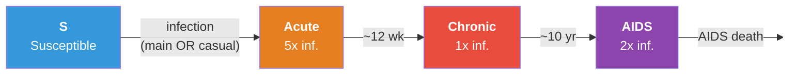
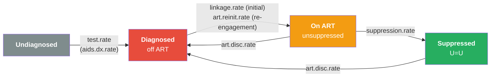

# HIV Transmission with Care Cascade and PrEP

## Description

A network HIV transmission model that compares two prevention mechanisms recognized in 2025-2026 HIV policy: the treatment-as-prevention effect of a working care cascade (95-95-95) and the susceptibility-reduction effect of pre-exposure prophylaxis (PrEP). The model brings together three EpiModel capabilities:

1. **A two-layer partnership network.** Main partnerships (long-duration, low-degree, high act rate) and casual partnerships (shorter-duration, lower-degree, lower act rate) are estimated as separate TERGMs that share the same node set. Both layers include a `concurrent` ERGM term, the structural feature most strongly implicated in generalized HIV spread (Morris & Kretzschmar 1997).

2. **An explicit care continuum.** Instead of a single binary `ART.status` attribute, every infected individual occupies one of four cascade states: undiagnosed, diagnosed (off ART), on ART (not yet suppressed), and virally suppressed. Transitions between states have separate, scenario-controlled rates so the model can replicate the UNAIDS 95-95-95 targets and the leakage at each step.

3. **PrEP as a risk-targeted, susceptibility-side intervention.** PrEP is implemented as a per-edge reduction in acquisition probability for susceptibles, with stochastic initiation and discontinuation. Eligibility follows the CDC behavioral-risk criteria: a node is indicated for PrEP if either its total current degree (across the main and casual layers) is at or above a threshold, or it has at least one current HIV-positive partner. Efficacy is set at 95%, the high end of oral TDF/FTC and injectable cabotegravir / lenacapavir performance under consistent adherence.

The headline question the example answers: **starting from a pre-treatment-era baseline, how much of the epidemic is averted by reaching UNAIDS 95-95-95, by rolling out PrEP at 50% coverage among HIV-negative individuals, and by combining the two?**

## Model Structure

### Disease Compartments

Disease progression is unidirectional, **S to Acute to Chronic to AIDS**. Each infected individual carries a separate cascade-state attribute.

| Compartment | `status` | `stage` | Description |
|-------------|----------|---------|-------------|
| Susceptible | `"s"` | `NA` | HIV-negative |
| Acute | `"i"` | `"acute"` | Recent infection; high viral load, ~5x infectiousness, ~12 weeks |
| Chronic | `"i"` | `"chronic"` | Long asymptomatic stage; reference infectiousness, ~10 years |
| AIDS | `"i"` | `"aids"` | Advanced disease; elevated mortality, ~2 years untreated |

A single Chronic stage is used because subdividing it into two stages with identical per-act transmissibility adds compartments without adding biology.

### Care Cascade

Every PLHIV occupies one of four cascade states defined by the joint values of `diag.status`, `art.status`, and `vl.supp`:

| State | `diag.status` | `art.status` | `vl.supp` | Per-act inf. multiplier |
|-------|---------------|--------------|-----------|-------------------------|
| Undiagnosed | 0 | 0 | 0 | 1 (full) |
| Diagnosed, off ART | 1 | 0 | 0 | 1 (full) |
| On ART, not yet suppressed | 1 | 1 | 0 | 0.30 |
| Virally suppressed (U=U) | 1 | 1 | 1 | 0.01 (essentially zero) |

The U=U value (0.01) reflects HPTN 052 and PARTNER trial evidence that durable viral suppression on ART eliminates sexual transmission. The intermediate 0.30 multiplier reflects the 2-3 month ramp from ART initiation to undetectable plasma viral load.

### Flow Diagram



Within each infected stage, the four cascade states are connected by:



AIDS-stage infections receive a higher `aids.dx.rate` to represent symptom-driven presentation to care. Nodes that discontinue ART (either before or after achieving suppression) return to the Diagnosed off ART state with their prior `art.time` retained, so subsequent re-engagement uses the (typically lower) `art.reinit.rate` rather than the initial `linkage.rate` --- reflecting the empirical pattern that re-engagement after disengagement is slower than initial linkage.

## Network Layers

Both layers are estimated as separate ERGMs that share the same node set. The simulation runs them simultaneously; transmission can happen on either layer per timestep.

### Main partnership layer

```r
formation_main <- ~edges + concurrent + degrange(from = 3)
```

- Mean degree: 0.5 (most people have 0-1 main partner at any time)
- Concurrency target: 4% of nodes have 2+ main partners simultaneously
- Maximum degree: capped at 2 (3+ simultaneous main partners is not a plausible structure)
- Partnership duration: 200 weeks (~4 years)
- Acts per partnership per week: 3

### Casual partnership layer

```r
formation_cas <- ~edges + concurrent
```

- Mean degree: 0.3
- Concurrency target: 10% of nodes have 2+ casual partners simultaneously. The Poisson baseline for mean degree 0.3 is ~3.7% (= 1 - exp(-0.3) * 1.3), so the `concurrent` term lifts concurrency to ~2.7x baseline rather than just leaving it at the Bernoulli-graph default. This is the level at which the `concurrent` term does meaningful structural work without making the degree distribution infeasible.
- Maximum degree: **not capped**. The right tail of casual degree (a small number of nodes with many concurrent casual ties) is the high-activity subgroup that drives a disproportionate share of transmission and is the natural PrEP target. Truncating it with `degrange()` would erase the structural heterogeneity the intervention is designed to address.
- Partnership duration: 26 weeks (~6 months)
- Acts per partnership per week: 1

## Modules

### `progress`
Disease stage progression: Acute to Chronic to AIDS. Uses a snapshot of `stage` at function entry so no individual cascades through two stages in a single timestep, regardless of progression rate. The first call to `progress()` also initializes all custom attributes (`stage`, `stage.time`, `diag.status`, `art.status`, `vl.supp`, `art.time`, `prep.status`) for the simulation. Seed-infected individuals are distributed across stages proportional to mean stage duration so the simulation begins near the stage-equilibrium distribution rather than as a synchronized cohort.

### `cascade`
The four-state care continuum. Per timestep, in snapshot order:
1. Undiagnosed PLHIV are tested at `test.rate` (or the higher `aids.dx.rate` if in AIDS stage).
2. Diagnosed PLHIV not on ART are linked to ART at `linkage.rate`.
3. PLHIV on ART but not yet suppressed achieve viral suppression at `suppression.rate`.
4. PLHIV on ART (any suppression state) discontinue at `art.disc.rate`, clearing both `art.status` and `vl.supp`.

The snapshot pattern means a person cannot move more than one cascade step per timestep, even when multiple rates are high. The combination of rates at equilibrium reproduces the UNAIDS 95-95-95 targets in the cascade scenario.

### `prep`
PrEP turnover among indicated HIV-negative individuals. At each step the module computes the indicated set as the union of two CDC-style criteria: total current degree (main + casual) at or above `prep.indic.deg` (default 2), and a current HIV+ partner. Initiation at `prep.start.rate` applies only to indicated susceptibles; discontinuation at `prep.stop.rate` applies to all current users regardless of indication, since adherence drop-off is driven by access and behavior rather than indication change. Initial coverage `prep.init.cov` is sampled among the initial indicated subset using the simulated network state on the first call. PrEP is cleared on HIV acquisition by the `infect` module.

### `infect`
Multilayer transmission. Iterates `discord_edgelist(dat, at, network = k)` over both layers; for each S-I edge, computes per-act probability as

```
p_act = inf.prob.act * stage_mult * art_mult * (1 - prep.efficacy * prep.status_sus)
p_edge = 1 - (1 - p_act)^acts_per_partnership
```

`stage_mult` is acute/chronic/aids relative infectiousness; `art_mult` is the cascade-state multiplier in the table above. New infections enter as Acute with cascade state undiagnosed.

### `dfunc`
Background departures at `departure.rate` for non-AIDS individuals, plus AIDS-stage departures at the elevated `aids.depart.rate`. Suppressive ART extends AIDS survival by `art.aids.surv.mult` (default 10x).

### `afunc`
Poisson arrivals at `arrival.rate * N`. New arrivals are HIV-negative and not on PrEP. Custom attributes are extended via `append_attr` to stay in lockstep with the EpiModel core attributes.

## Parameters

### Transmission biology

| Parameter | Description | Default | Source |
|-----------|-------------|---------|--------|
| `inf.prob.act` | Per-act transmission probability (chronic stage, off-ART reference) | 0.0025 | Order of magnitude for receptive anal intercourse (Patel et al. 2014) |
| `rel.inf.acute` | Acute-stage infectiousness multiplier | 5 | Hollingsworth, Anderson, Fraser (2008) |
| `rel.inf.aids` | AIDS-stage infectiousness multiplier | 2 | Less well-supported; partially offsets reduced AIDS-stage sexual activity |
| `rel.inf.art.unsupp` | Multiplier while on ART but not yet suppressed | 0.30 | Intermediate during 2-3 month ramp to undetectable VL |
| `rel.inf.art.supp` | Multiplier while virally suppressed (U=U) | 0.01 | HPTN 052, PARTNER, PARTNER-2 |
| `prep.efficacy` | Per-edge susceptibility reduction on PrEP | 0.95 | Daily oral TDF/FTC with consistent adherence; CAB-LA and lenacapavir support similar or higher values |

### Partnership behavior

| Parameter | Description | Default |
|-----------|-------------|---------|
| `acts.main` | Sex acts per main partnership per week | 3 |
| `acts.casual` | Sex acts per casual partnership per week | 1 |

### Disease progression (per week)

| Parameter | Description | Default |
|-----------|-------------|---------|
| `acute.to.chronic.rate` | Acute to Chronic transition | 1/12 (~12 weeks) |
| `chronic.to.aids.rate` | Chronic to AIDS transition | 1/520 (~10 years) |
| `aids.depart.rate` | AIDS-stage mortality rate | 1/104 (~2 years untreated) |
| `art.prog.mult` | Multiplier on progression rates while virally suppressed | 0.5 |
| `art.aids.surv.mult` | Multiplier on AIDS mortality while virally suppressed | 0.1 (10x longer survival) |

### Care cascade

| Parameter | Description | Cascade scenario |
|-----------|-------------|------------------|
| `test.rate` | Per-week testing rate for acute/chronic undiagnosed PLHIV | 0.015 |
| `aids.dx.rate` | Per-week diagnosis rate for AIDS-stage undiagnosed PLHIV | 0.050 |
| `linkage.rate` | Per-week ART initiation among newly-diagnosed PLHIV | 0.100 |
| `art.reinit.rate` | Per-week ART re-engagement among previously-on-ART PLHIV | 0.030 |
| `suppression.rate` | Per-week rate of achieving viral suppression after ART start | 1/12 |
| `art.disc.rate` | Per-week ART discontinuation rate (on-ART, any suppression) | 0.002 |

These rates produce UNAIDS 95-95-95 attainment at equilibrium: ~98% diagnosed, ~92% on ART, ~89% virally suppressed. Adjusting them lets the user explore weaker cascades (e.g. 80-80-80 or 90-90-90).

### PrEP

| Parameter | Description | PrEP scenario |
|-----------|-------------|---------------|
| `prep.indic.deg` | Total-degree threshold for PrEP indication | 2 |
| `prep.init.cov` | Initial coverage among indicated susceptibles at t = 0 | 0.50 |
| `prep.start.rate` | Per-week initiation among indicated, off-PrEP susceptibles | 0.015 |
| `prep.stop.rate` | Per-week discontinuation among on-PrEP susceptibles | 0.015 |

Equilibrium coverage *among indicated susceptibles* = `start / (start + stop)` = 50%. Population-wide PrEP coverage is lower because the indicated subset is only ~25-30% of susceptibles at any time.

### Vital dynamics

| Parameter | Description | Default |
|-----------|-------------|---------|
| `arrival.rate` | Per-capita weekly arrival rate | 0.00065 |
| `departure.rate` | Background per-capita weekly departure rate | 0.0005 |

The arrival rate slightly exceeds the background departure rate to compensate for AIDS mortality in scenarios without ART. With a working cascade, AIDS mortality is small and the population grows slightly; without ART the population is roughly stable as AIDS deaths offset the arrival surplus.

## Population Size and Time Horizon

The example runs at `N = 1500` for `nsteps = 1040` (20 years at weekly timesteps) in interactive mode. This is larger than most Gallery examples because HIV is a slow disease: the chronic stage alone is ~10 years, so any meaningful intervention comparison needs at least one chronic-stage turnover. The 20-year horizon catches the no-intervention scenario near its epidemic peak and the cascade / combined scenarios well into their elimination trajectory. CI mode uses `N = 300` and `nsteps = 100` for a smoke test; results there are not meant to be interpretable.

## Scenarios

| Scenario | Cascade | PrEP | Interpretation |
|----------|---------|------|----------------|
| `none` | off | off | Pre-treatment-era counterfactual |
| `cascade` | UNAIDS 95-95-95 | off | Treatment-as-prevention (U=U) only |
| `prep` | off | 50% coverage | Susceptibility-reduction only |
| `both` | UNAIDS 95-95-95 | 50% coverage | Combined intervention |

## Headline Result

At `N = 1500`, 8% seed prevalence, 20-year horizon, with the parameters above:

| Scenario | Final prev. | Final incidence per 100PY | Cum. infections | Infections averted |
|---|---:|---:|---:|---:|
| No intervention | ~14% | ~1.7 | ~430 | (reference) |
| Cascade (95-95-95) | ~5% | ~0.15 | ~70 | ~84% |
| PrEP (indicated, 50%) | ~7% | ~0.8 | ~250 | ~43% |
| Cascade + PrEP | ~4% | ~0.1 | ~45 | ~89% |

A 95-95-95 cascade alone bends the prevalence curve downward (treatment-as-prevention), reproducing the elimination trajectory at the heart of Granich et al. 2009 but with realistic cascade leakage. Risk-targeted PrEP cuts new infections by about 40% despite covering only ~10-15% of the total susceptible population, because the indication criteria concentrate the doses on the people most likely to be exposed. The combined intervention is the most efficient on both axes and is closest to the elimination target.

The scenarios are deliberately structured so users can change the coverage levels (cascade rates, PrEP coverage, `prep.indic.deg`), the network parameters (mean degree, concurrency, partnership durations), or the transmission biology (per-act probability, stage multipliers) and see how the comparison shifts. The PrEP and cascade scenarios are *not* meant as policy recommendations; they are mechanism isolators.

## Next Steps

- **Heterogeneity by risk group.** Stratify the population into low-/high-activity groups and vary `acts.casual`, PrEP eligibility, and testing rate by stratum. See the [SI with Vital Dynamics](../si-vital-dynamics/) example for a similar attribute-based pattern.
- **A third partnership layer.** Add a one-time/instantaneous contact layer (per-capita Poisson contact rate) to capture transient anonymous contacts that don't form persistent ties. This is the EpiModelHIV pattern and is the next structural step toward a research-grade HIV model.
- **PrEP product differentiation.** Replace the single `prep.efficacy` with product-specific efficacy and adherence dynamics (oral TDF/FTC vs. injectable CAB-LA vs. lenacapavir). Useful for cost-effectiveness work (see the [Cost-Effectiveness Analysis](../cost-effectiveness/) example).
- **Calibration to surveillance data.** Use the model framework to fit `inf.prob.act`, `acts.main`, and cascade rates to an observed prevalence trajectory or surveillance dataset.
- **Care cascade leakage scenarios.** Run sensitivity sweeps on `test.rate`, `linkage.rate`, `suppression.rate`, and `art.disc.rate` to identify which stage of the cascade is most consequential for population-level incidence (the leverage analysis from the Marshall et al. 2018 line of work).

For a research-grade EpiModel HIV implementation that addresses many of these extensions (multi-layer network, race / age structure, integrated continuum, PrEP product mix), see [EpiModelHIV](https://github.com/EpiModel/EpiModelHIV).

## References

Treatment-as-prevention and the care cascade:

- Cohen MS, Chen YQ, McCauley M, et al. (2011, with 2016 update). Prevention of HIV-1 infection with early antiretroviral therapy. *New England Journal of Medicine* 365(6):493-505 / 375(9):830-839. (HPTN 052)
- Rodger AJ, Cambiano V, Bruun T, et al. (2019). Risk of HIV transmission through condomless sex in serodifferent gay couples with the HIV-positive partner taking suppressive antiretroviral therapy (PARTNER): final results of a multicentre, prospective, observational study. *Lancet* 393(10189):2428-2438. (U=U)
- UNAIDS. 95-95-95 targets and Global AIDS Strategy 2021-2026. https://www.unaids.org/

Transmission biology and stage-dependent infectiousness:

- Hollingsworth TD, Anderson RM, Fraser C (2008). HIV-1 transmission, by stage of infection. *Journal of Infectious Diseases* 198(5):687-693.
- Patel P, Borkowf CB, Brooks JT, et al. (2014). Estimating per-act HIV transmission risk: a systematic review. *AIDS* 28(10):1509-1519.

PrEP:

- Grant RM, Lama JR, Anderson PL, et al. (2010). Preexposure chemoprophylaxis for HIV prevention in men who have sex with men. *NEJM* 363(27):2587-2599. (iPrEx, oral TDF/FTC)
- Landovitz RJ, Donnell D, Clement ME, et al. (2021). Cabotegravir for HIV prevention in cisgender men and transgender women. *NEJM* 385(7):595-608. (HPTN 083)
- Bekker LG, Das M, Karim QA, et al. (2024). Twice-yearly lenacapavir or daily F/TAF for HIV prevention in cisgender women. *NEJM* 391(13):1179-1192. (PURPOSE 1)

Network structure and concurrency:

- Morris M, Kretzschmar M (1997). Concurrent partnerships and the spread of HIV. *AIDS* 11(5):641-648.
- Jenness SM, Goodreau SM, Morris M (2018). EpiModel: An R Package for Mathematical Modeling of Infectious Disease over Networks. *Journal of Statistical Software* 84(8):1-47.

Historical anchor:

- Granich RM, Gilks CF, Dye C, De Cock KM, Williams BG (2009). Universal voluntary HIV testing with immediate antiretroviral therapy as a strategy for elimination of HIV transmission: a mathematical model. *Lancet* 373(9657):48-57.

The parameters here are illustrative choices selected to (a) produce a sustained HIV epidemic in the no-intervention scenario, (b) reach UNAIDS 95-95-95 attainment under the cascade scenario, and (c) demonstrate the qualitative comparison between cascade-based and PrEP-based prevention. They are not calibrated to any specific surveillance dataset.

## Authors

Samuel M. Jenness, Connor Van Meter, Yuan Zhao, Emeli Anderson
