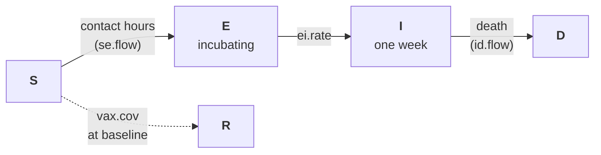

# Rabies on an Observed Raccoon Contact Network

## Description

A zoonotic pathogen simulated over an empirical wildlife network. Reynolds et al. (2015) fitted proximity-logging collars to raccoons in a suburban forest preserve in Illinois and recorded every close contact for a year; the data deposited with the paper are 52 weekly matrices of contact time between 24 raccoons. Every animal and every contact are observed, so there is nothing to estimate: the network enters `netsim` as it is, through `netcensus()`, and the simulation reads the contacts of week `at` at time step `at`. No `netest`, no `netdx`.

The example asks the source paper's question: how much does the week of introduction matter for a rabies outbreak, and how much vaccination coverage does it take to keep one small? One infectious raccoon is introduced in one of four weeks of the year into a population with 0, 30, or 60 percent baseline oral rabies vaccination coverage, and the outcome is the number of secondary cases. Contact intensity comes from the data: the per-pair transmission probability is a constant hazard per hour of proximity, so a shared den transmits almost surely and a brief encounter rarely does.

The annotated tutorial is on the [Gallery website](https://epimodel.github.io/EpiModel-Gallery/examples/rabies-raccoon-network/).

This example requires EpiModel 2.6.3 or later, which added `netcensus()`.

## Model Structure

| Status | Description |
|--------|-------------|
| `s` | Susceptible |
| `e` | Exposed: infected and incubating (geometric, mean 5 weeks) |
| `i` | Infectious: clinical rabies, transmits for one week, then dies |
| `d` | Dead of rabies |
| `r` | Vaccinated, immune |

The time step is one week, the resolution of the contact data. The observed year is played twice so that a chain started late in the year can run its course; this is the one modeling assumption layered on top of the data.

### The observed network layer

`raccoon_contacts.csv` holds the weekly contact matrices in long form (week, raccoon1, raccoon2, seconds), from the Animal Social Network Repository copy of the Dryad deposit. Each dyad-week becomes an edge spell in a `networkDynamic` object, and `netcensus()` wraps that object as a layer. The layer is binary; the hours of contact per pair and week go to the infection module as a parameter.

### Modules

- `infect`: discordant pairs from `discord_edgelist()` on the census layer, transmission with probability `1 - exp(-inf.hazard * hours)`, recorded with `set_transmat()` together with the contact hours.
- `progress`: exposed to infectious at `ei.rate` per week; infectious raccoons die at the end of their infectious week. A dead raccoon stays in the census as an inert node, since the node set of an observed network is fixed.
- `introduce`: one susceptible raccoon with a contact in `intro.week` becomes infectious.
- `vaccinate`: a random fraction `vax.cov` set to `r` at baseline.

## Parameters

| Parameter | Value | Meaning |
|-----------|-------|---------|
| `inf.hazard` | 2 per hour | Transmission hazard per hour of proximity; median pair 0.09, one hour 0.86, shared den 1 |
| `ei.rate` | 1/5 per week | Mean incubation of five weeks |
| `intro.week` | 4, 17, 30, 43 | Week of introduction; the breeding season is weeks 24 to 39 |
| `vax.cov` | 0, 0.3, 0.6 | Baseline vaccination coverage |

## Key Findings

An introduction in week 4, when the raccoons are in contact with many others but briefly, almost never spreads. Introductions in weeks 17 and 30, when pairs are fewer but spend hours or days together, produce the largest outbreaks: the season effect in the source paper is the long-duration associations of the breeding season and the months around it, not the number of contacts. For a week-30 introduction, 30 percent coverage roughly halves the mean number of secondary cases and the probability of a five-case outbreak, and 60 percent coverage, the seroconversion level modeling studies put as the threshold for preventing epizootics, brings that probability close to zero. Below the threshold the residual risk is structural: one unvaccinated den-mate of the introduced animal is enough for a chain to start. Most transmissions occur over pairs with at least an hour of contact in the week, although such pairs are a small share of all pair-weeks.

## References

- Reynolds JJH, Hirsch BT, Gehrt SD, Craft ME. Raccoon contact networks predict seasonal susceptibility to rabies outbreaks and limitations of vaccination. *Journal of Animal Ecology*. 2015;84(6):1720-1731. <https://doi.org/10.1111/1365-2656.12422>. Data: <https://doi.org/10.5061/dryad.gr40r>.
- Sah P, Mendez JD, Bansal S. A multi-species repository of social networks. *Scientific Data*. 2019;6:44. <https://doi.org/10.1038/s41597-019-0056-z>.
- Elmore SA, Chipman RB, Slate D, Huyvaert KP, VerCauteren KC, Gilbert AT. Management and modeling approaches for controlling raccoon rabies: The road to elimination. *PLoS Neglected Tropical Diseases*. 2017;11(3):e0005249. <https://doi.org/10.1371/journal.pntd.0005249>.
- Farine DR, Whitehead H. Constructing, conducting and interpreting animal social network analysis. *Journal of Animal Ecology*. 2015;84(5):1144-1163. <https://doi.org/10.1111/1365-2656.12418>.

The rabies parameters are illustrative choices within published ranges and are not calibrated to surveillance data.

## Author

Samuel M. Jenness, Emory University (http://samueljenness.org/)
