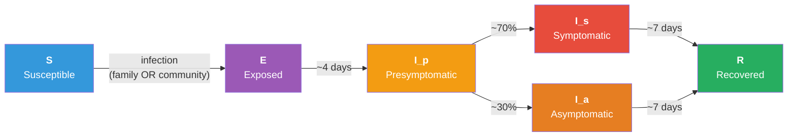

# Age-Stratified RSV on a Multilayer Network

## Description

A respiratory disease example grounded in RSV biology and the 2023-2024 vintage of RSV interventions. The model brings together three EpiModel capabilities that no current Gallery example combines:

1. **A multilayer contact network.** Two age-aware network layers run simultaneously: a *family* layer (long-duration ties, low-degree, adults as hubs to children and elderly) and a *community* layer (transient ties, high-degree, age-assortative). Both layers are estimated via `nodemix` so we can target specific cells of the age-by-age mixing matrix --- diagonal (within-age) and off-diagonal (cross-age) cells in one model.

2. **A five-stratum age structure.** Infants, young (1-4), school-age (5-17), adults, and elderly. Age governs network contacts (school-age children have the highest community degree; infants have almost none), per-infection severity (infants and elderly bear nearly all hospitalization risk), and which interventions a person is eligible for.

3. **Age-targeted interventions matched to real biomedical products.**
   - Older-adult vaccination (Arexvy / Abrysvo style: leaky, ~75% reduction in susceptibility, 65+ only)
   - Infant passive antibody prophylaxis (Nirsevimab style: ~70% reduction, 0-1 year olds, applied at season start)
   - NPI overlay (masking + distancing during the peak window, days 20-80)

The headline policy question the example answers: *given the same season, which intervention prevents the most hospitalizations, and how does dose efficiency compare across age targets?*

## Model Structure

### Disease Compartments

| Compartment | Status | Description |
|-------------|--------|-------------|
| **S** | `"s"` | Susceptible |
| **E** | `"e"` | Exposed (latent, not yet infectious) |
| **I_p** | `"i"` + `inf_stage="ip"` | Presymptomatic infectious (~2 days) |
| **I_s** | `"i"` + `inf_stage="is"` | Symptomatic infectious (~7 days) |
| **I_a** | `"i"` + `inf_stage="ia"` | Asymptomatic infectious (~7 days, 0.5x infectiousness) |
| **R** | `"r"` | Recovered |

The presymptomatic and asymptomatic split is what motivates NPIs for respiratory pathogens: symptom-driven isolation alone misses the ~30% of cases that never develop symptoms and the substantial transmission that occurs before symptoms appear.

### Flow Diagram



### Age Structure

Five categorical age groups stored as a vertex attribute. Distribution is matched approximately to the United States.

| Group | Range | Pop fraction | Community degree | Family role |
|-------|-------|--------------|------------------|-------------|
| infant | 0-1 | ~1.2% | ~1 | hub of family ties (parent-baby) |
| young | 1-4 | ~5% | ~5 | family + some daycare |
| school | 5-17 | ~16% | ~8 | school amplifier of community spread |
| adult | 18-64 | ~60% | ~6 | family hub + workplace |
| elderly | 65+ | ~17% | ~3 | family + lower-density community |

## Network Layers

Both layers are estimated as separate ERGMs that share the same node set and `age` attribute. The simulation runs them simultaneously as a true multilayer; transmission can happen on either layer per timestep.

### Family Layer (long-duration, low-degree)

```r
formation_fam <- ~edges + nodemix("age", levels2 = c(1, 4, 7, 11, 3, 10))
```

The `nodemix` targets six cells of the upper-triangle mixing matrix (column-major order). Each cell name uses ergm's alphabetical level ordering:

| levels2 | Cell | Why |
|---|---|---|
| 1 | adult.adult | couples + adult-only households |
| 4 | adult.infant | parent-baby |
| 7 | adult.school | parent-child |
| 11 | adult.young | parent-toddler |
| 3 | elderly.elderly | elderly couples |
| 10 | school.school | siblings |

The remaining nine cells (adult.elderly, elderly.{infant,school,young}, infant.{infant,school,young}, school.young, young.young) are left unconstrained --- they take whatever values are consistent with the targeted cells and total edge count.

Partnership duration: equal to the simulation horizon as a *mean* (not a hard guarantee). Ties are still resimulated each step, so a noticeable fraction of family edges turn over during the season -- the layer is best read as "long-duration close contact" rather than a fixed household roster.

### Community Layer (transient, high-degree)

```r
formation_com <- ~edges + nodemix("age", levels2 = c(1, 3, 10, 15, 7))
```

| levels2 | Cell | Why |
|---|---|---|
| 1 | adult.adult | workplace + social |
| 3 | elderly.elderly | community groups |
| 10 | school.school | the **school amplifier** -- main driver of seasonal RSV peaks |
| 15 | young.young | daycare |
| 7 | adult.school | parents at school events / pickup |

Partnership duration: 1 day (each day's casual contacts are largely new).

### Why nodemix and not nodefactor or absdiff

- `nodefactor("age")` only controls per-age *activity* (the marginal degree distribution). It says nothing about who-mixes-with-whom, so the within-age clustering needed for the school amplifier won't appear unless we get lucky.
- `nodematch("age", diff = TRUE)` adds within-age homophily for each level but leaves the cross-age cells unconstrained.
- `absdiff` with a numeric age treats age as a continuous distance --- works for clean homophily by age but cannot encode the asymmetric "adult-as-family-hub" structure that drives infant transmission.
- `nodemix` is the union of all three: every diagonal and off-diagonal cell of the mixing matrix is individually targetable. We constrain only the epidemiologically meaningful cells, leaving the rest free, so ergm has room to fit without saturation.

## Modules

### `init_attrs`
Sets the per-node `vax_status` (one of `NA`, `"elderly_vax"`, `"infant_proph"`) and `inf_stage` (`"ip"`/`"is"`/`"ia"`/`NA`) attributes on the first call. Coverage is drawn from per-scenario parameters.

### `infect`
Walks the edgelist of each network layer separately. For each discordant pair, applies a per-edge transmission probability: family or community base rate, scaled down by the asymptomatic multiplier if the infectious partner is asymptomatic, the community NPI factor when NPIs are active, and the susceptible person's vaccine / prophylaxis efficacy. New infections enter state `"e"`.

### `progress`
Three transitions per timestep:
- E to I_p at rate `ei.rate`
- I_p to I_s or I_a (with probability `asymp.prob`) at rate `ip.rate`
- I_s / I_a to R at rate `ir.rate`

Also records age-stratified cumulative-infection counters (`cuminf.infant`, `cuminf.young`, ...) used by the analysis.

## Parameters

### Disease (daily timestep, RSV natural history)

| Parameter | Description | Default | Source |
|-----------|-------------|---------|--------|
| `inf.prob.family` | Per-edge family-layer transmission probability | 0.05 | Calibrated to ~50% seasonal attack rate |
| `inf.prob.community` | Per-edge community-layer transmission probability | 0.018 | Calibrated |
| `asymp.inf.mult` | Asymptomatic infectiousness multiplier | 0.5 | Hall et al., published RSV transmission studies |
| `ei.rate` | Exposed-to-presymptomatic rate | 1/4 | Mean 4-day latent period |
| `ip.rate` | Presymp-to-clinical rate | 1/2 | Mean 2-day presymptomatic |
| `ir.rate` | Clinical-to-recovered rate | 1/7 | Mean 7-day infectious |
| `asymp.prob` | Fraction asymptomatic | 0.3 | Population-average |

### Interventions

| Parameter | Description | Real-world reference |
|-----------|-------------|---------------------|
| `elderly.vax.efficacy` | Susceptibility reduction in vaccinated elderly | 0.75 (Arexvy ~83% vs LRTI, ~67% vs RTI) |
| `infant.proph.efficacy` | Susceptibility reduction in infants on prophylaxis | 0.70 (Nirsevimab ~75% vs MA-LRTI) |
| `npi.mask.efficacy` | Per-edge inf.prob reduction on community layer during NPIs | 0.4 |
| `npi.contact.mult` | Community edge thinning under NPIs | 0.7 |
| `npi.start` / `npi.end` | NPI activation window (timesteps) | 20 - 80 |

### Hospitalization rates per infection by age (post-hoc multiplier)

| Group | Rate | Notes |
|-------|------|-------|
| infant | 0.050 | Highest per-infection risk |
| young | 0.008 | Elevated but lower than infants |
| school | 0.002 | Low |
| adult | 0.005 | Low |
| elderly | 0.030 | Second-highest |

These values are **illustrative**, not directly estimated. They reflect the qualitative RSV-NET pattern (high in infants and older adults, low in school-age) without being calibrated to any one season's surveillance data. RSV-NET publishes age-specific *population* hospitalization rates per 100,000, not per infection; converting them to per-infection probabilities requires assumptions about season-specific infection attack rates by age that vary year to year. Treat these as a teaching multiplier rather than a fitted estimate. See the References section for primary sources.

Hospitalizations are *not* a separate compartment in the simulation. They are computed by multiplying simulated cumulative infections per age group by the per-infection hospitalization risk. This separation keeps the disease model simple while letting the analysis answer the headline policy question.

## Population Size

The example runs at `N = 5000` in interactive mode. This is larger than the rest of the Gallery for two reasons: the five age strata need to be well-populated (especially infants, which are only ~1% of the population), and the multilayer network estimation is more stable at this scale.

A convergence analysis is included as part of the development notes: at `N = 1000`, the infant attack rate has CV ~0.70 across simulation replicates (one simulation can differ from the mean by ~70%) --- enough that the infant-prophylaxis story becomes noisy. By `N = 5000`, infant CV is ~0.22 and all other strata are below ~0.05. CI mode uses `N = 500` for speed; results there are not meant to be interpretable.

## Scenarios

| Scenario | Notes |
|----------|-------|
| `none` | Counterfactual, no intervention |
| `elderly_vax` | 70% coverage of all 65+ (simplified from CDC's 75+ universal / 50-74 high-risk), leaky 75% susceptibility reduction (stylized; see below) |
| `infant_proph` | 80% coverage of 0-1 year olds, leaky 70% susceptibility reduction (stylized) |
| `both` | Both age-targeted interventions in combination |
| `npi` | Masking + distancing on the community layer, days 20-80 only |

### Caveat on intervention efficacy

Real RSV vaccines and monoclonal-antibody prophylaxis are licensed and evaluated against medically-attended outcomes (LRTI, hospitalization, severe disease) --- not sterilizing protection against infection. The model implements each intervention as a per-edge reduction in susceptibility to *infection*, which is a pedagogical simplification: it lets the same downstream pipeline (infections × per-age hospitalization risk) approximate the headline benefit, but it does not represent how the underlying biology or the regulatory endpoints actually work.

Real-world CDC guidance also differs from the model's blanket-eligibility wording:

- **Adult vaccine** (Arexvy / Abrysvo): a single dose for adults 75+ and for adults 50-74 at increased risk of severe disease. The model's "all 65+" scope is a simplification.
- **Infant prophylaxis**: maternal RSV vaccination OR an infant long-acting monoclonal antibody (nirsevimab or clesrovimab). Only the infant-side monoclonal antibody is modeled here.

See the References section for current CDC sources.

## Headline Result

At N=5000 with the parameters above, the baseline season produces ~27 hospitalizations across all ages (~57% of them in elderly). Elderly vaccination cuts elderly infections by ~57%, averting ~12 hospitalizations. Infant prophylaxis is comparable per-dose in the targeted group but much smaller in absolute terms (infants are 1% of the population). NPIs avert ~9 hospitalizations across all ages without per-dose costs but with substantial societal costs not modeled here.

The example is structured so users can change the coverage levels, the vaccine efficacies, the network mean degrees, or the hospitalization risks and see how the policy ranking changes.

## Next Steps

- **Multi-season dynamics.** Add R-to-S waning of natural immunity (`rs.rate`) and re-run for multiple winters to capture year-on-year accumulation of population immunity and the resulting epidemic-period shift.
- **Calibration to surveillance data.** Fit `inf.prob.family` and `inf.prob.community` to match published age-specific attack rates (issue #58).
- **Waning vaccine immunity.** Nirsevimab protects ~5 months; Arexvy waning is still being characterized. A V to S flow at age-specific rates would let the model evaluate two- or three-season campaigns.
- **Combined intervention timing.** Pair this example's biomedical interventions with the windowed/reactive activation pattern from [SIR with Time-Varying Vaccination](../sir-time-varying-vaccination/).
- **Replace nodemix with explicit households.** Use `blocks()` or pre-constructed household edgelists to enforce clique structure within households. Costs ERGM identifiability; gains biological realism.

## References

CDC guidance (accessed November 2025):

- CDC, RSV vaccine guidance for adults: https://www.cdc.gov/rsv/hcp/vaccine-clinical-guidance/adults.html
- CDC, RSV immunization guidance for infants and young children: https://www.cdc.gov/rsv/hcp/vaccine-clinical-guidance/infants-young-children.html
- CDC ACIP, GRADE review for protein-subunit RSV vaccines in older adults: https://www.cdc.gov/acip/grade/protein-subunit-rsv-vaccines-older-adults.html
- CDC MMWR, Nirsevimab recommendations (Jones et al., 2023): https://www.cdc.gov/mmwr/volumes/72/wr/mm7234a4.htm
- CDC RSV Surveillance (RSV-NET): https://www.cdc.gov/rsv/research/rsv-net/dashboard.html

Epidemiological background:

- Hall CB, Weinberg GA, Iwane MK, et al. (2009). The burden of respiratory syncytial virus infection in young children. *N Engl J Med* 360(6):588-598.
- Falsey AR, Hennessey PA, Formica MA, et al. (2005). Respiratory syncytial virus infection in elderly and high-risk adults. *N Engl J Med* 352(17):1749-1759.

The model parameters --- network mean degrees, age-mixing targets, per-edge transmission probabilities, and hospitalization risks --- are illustrative choices selected to reproduce the qualitative RSV pattern (high burden at the age extremes; school-age children as a transmission amplifier). They are not directly calibrated to any specific surveillance dataset or season.

## Author

Samuel M. Jenness, Emory University (http://samueljenness.org/)
