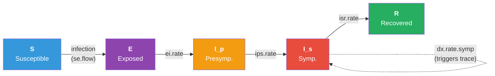

# SEIR with Contact Tracing for an Acute, Immunizing Infection

## Description

This example demonstrates **contact tracing as a network intervention** for an acute, immunizing, COVID-like infection. The disease model is an SEIR with a presymptomatic infectious split (`Ip` then `Is`), so transmission can occur in a window before symptoms appear. The custom `trace` module reads EpiModel's cumulative edgelist to walk recent contacts of each newly diagnosed index case, applies a Bernoulli reach probability, and quarantines the contacts it reaches.

The pedagogical core of the example is the **cumulative-edgelist API pattern** (`cumulative.edgelist = TRUE` in `control.net()`, then `get_partners()` plus `get_posit_ids()` inside a module). The mechanism generalizes to any partner-services intervention: contact tracing, partner notification, expedited partner therapy, or ring vaccination.

## Model Structure

### Disease Compartments

| Status | Description |
|--------|-------------|
| `s` | Susceptible |
| `e` | Exposed (latent, not yet infectious) |
| `ip` | Presymptomatic infectious (transmits, not detectable) |
| `is` | Symptomatic infectious (transmits, detectable by symptoms) |
| `r` | Recovered, immune |

### Flow Diagram



`ip` and `is` are stored as the `status` attribute values directly, so the compartment counts read cleanly from a single attribute and a parallel `inf.stage` carries the same information for any module that needs the substage.

### The Contact-Tracing Pattern

The headline module pattern is the cumulative-edgelist round-trip. Inside the `trace` module:

```r
# 1. Indices whose diagnosis is trace.delay steps old this step.
idsIndex <- which(active == 1 &
                  !is.na(dx.time) &
                  (at - dx.time) == trace.delay)

# 2. get_partners takes positional ids, returns unique ids.
part_df <- get_partners(dat, idsIndex,
                        truncate = trace.lookback,
                        only.active.nodes = TRUE)

# 3. Convert partner unique ids back to positional ids before
#    indexing into the attribute vectors.
partner_pid <- get_posit_ids(dat, part_df$partner)
partner_pid <- partner_pid[!is.na(partner_pid)]
```

The unique-id round trip is the gotcha future readers will trip over: `get_partners()` returns `unique` ids in the partner column because a partner may have departed since the partnership existed, but the simulation's attribute vectors are indexed by positional ids. Translating with `get_posit_ids()` is the safe pattern.

Three `control.net()` switches activate the machinery:

| Switch | Effect |
|--------|--------|
| `cumulative.edgelist = TRUE` | Build a running history of dissolved (and active) edges |
| `truncate.el.cuml = trace.lookback` | Drop edges older than this many steps (memory bound) |
| `save.cumulative.edgelist = TRUE` | Attach the final history to the returned sim |

## Modules

### Attribute Initializer (`init_attrs`)

Lazily allocates the auxiliary tracing attributes on first call: `dx.time`, `dx.this.step`, `quar.until`, `traced.count`, and `inf.stage`. Seed infections (`status == "i"`) are placed in the presymptomatic substage so they progress through the same pipeline as later secondary cases.

### Infection (`infect`)

Walks the cross-sectional edgelist and identifies discordant edges (one `s`, one `ip` or `is`). The per-edge effective act rate is multiplied by `quar.act.mult` if either endpoint is currently quarantined (`at <= quar.until`). This single mechanism captures both index isolation (post-diagnosis) and traced-contact quarantine. Records `se.flow`.

### Progression (`progress`)

Snapshot-based stage transitions: E to Ip at `ei.rate`, Ip to Is at `ips.rate`, Is to R at `isr.rate`. Symptomatic, undiagnosed Is cases are tested at `dx.rate.symp` per step; on diagnosis a node receives `dx.time = at`, `dx.this.step = 1`, and `quar.until = at + iso.duration` (index isolation). Records `ei.flow`, `ips.flow`, `ir.flow`, `dx.flow`, and the cross-sectional compartment counts.

### Prevalence (`prev`)

A minimal replacement for `prevalence.net` that correctly counts `i.num = ip.num + is.num` (the built-in counts `status == "i"`, which is never true in this parameterization).

### Tracing (`trace`)

The headline module. For each diagnosed index whose `at - dx.time == trace.delay`, calls `get_partners()` over the cumulative edgelist with `truncate = trace.lookback`, converts the returned unique ids to positional ids, drops contacts who are already diagnosed, and Bernoulli-thins by `trace.reach.prob`. Reached contacts have their `quar.until` extended to `at + quar.duration`. Records `trace.idx.flow`, `trace.reach.flow`, `trace.quar.flow`, and the running `quar.num`.

## Parameters

### Disease

| Parameter | Description | Default |
|-----------|-------------|---------|
| `inf.prob` | Per-act transmission probability | 0.05 |
| `act.rate` | Acts per partnership per day | 2 |
| `ei.rate` | E to Ip transition rate (mean 3 days latent) | 1/3 |
| `ips.rate` | Ip to Is transition rate (mean 2 days presymptomatic) | 1/2 |
| `isr.rate` | Is to R transition rate (mean 6 days symptomatic) | 1/6 |
| `dx.rate.symp` | Per-day diagnosis rate for undiagnosed Is | 0.5 |
| `iso.duration` | Days of index isolation after diagnosis | 10 |

### Tracing

| Parameter | Description | Default |
|-----------|-------------|---------|
| `trace.reach.prob` | Per-partner probability of successful contact | 0.0 (no tracing) |
| `trace.delay` | Days from index diagnosis to contact reach | 0 |
| `trace.lookback` | Days of partner history traversed | 3 |
| `quar.duration` | Days a reached contact stays quarantined | 10 |
| `quar.act.mult` | Act-rate multiplier during quarantine | 0.1 |

### Network

A single-layer dynamic contact network with mean degree 3 and mean partnership duration 10 days (treat each step as 1 day). Network is intentionally simple so the focus stays on the tracing mechanism.

| Parameter | Default |
|-----------|---------|
| Population size | 500 (interactive); 200 (CI) |
| Target edges | 1.5 x n (mean degree 3) |
| Partnership duration | 10 days |

## Module Execution Order

```
resim_nets -> summary_nets -> initAttr -> infection -> progress -> trace -> nwupdate -> prevalence
```

The trace module reads `dx.this.step` (set by progress) and writes `quar.until`; the next step's infection module reads that `quar.until` to apply the act-rate multiplier.

## Scenarios

All four scenarios share the same fitted network, the same disease parameters, and 10 seed infections. They differ only in the tracing configuration.

| Scenario | Configuration | Teaching point |
|----------|---------------|----------------|
| No tracing | `trace.reach.prob = 0` | Counterfactual; indices still self-isolate |
| Fast + high | reach 80%, delay 1 day | The benchmark for an aggressive program |
| Slow + high | reach 80%, delay 4 days | Delay alone kills the effect even at high reach |
| Fast + low | reach 30%, delay 1 day | Speed without coverage |

## Next Steps

- **Sweep the lookback window.** Cumulative-edgelist size scales with `trace.lookback`. Vary it across the partnership-duration range to find the marginal value of going further back in time.
- **Add provider-side capacity limits** by capping the number of traced indices per day or budgeting tracer staff hours.
- **Combine with vaccination.** Layer the time-varying vaccination pattern from [SIR with Time-Varying Vaccination](../sir-time-varying-vaccination) on top of contact tracing.
- **Multilayer extension.** Run the same trace module over a household + casual two-layer network (see [RSV](../rsv) for a layered pattern).
- **Pre-exposure prophylaxis for reached contacts** instead of (or in addition to) quarantine: at the reach event, advance the contact's status to a protected state for the duration.

## Author

Samuel M. Jenness, Emory University (http://samueljenness.org/)
