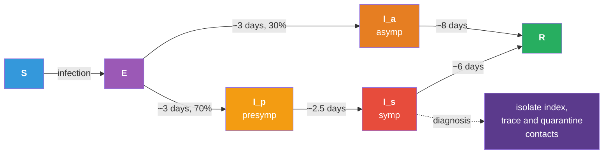

# SEIR with Contact Tracing for an Acute, Immunizing Infection

## Description

This example demonstrates **contact tracing as a network intervention** for a COVID-like acute infection. The disease model is an SEIR with a presymptomatic infectious stage and an asymptomatic branch, so about 45% of transmission from symptomatic infections happens before symptoms and 30% of infections are never detectable by symptoms. Symptom-based diagnosis with isolation is the standard of care; a custom `trace` module adds contact tracing on top of it by finding each diagnosed index's recent contacts through EpiModel's **cumulative edgelist**, keeping the ones whose partnership overlapped the contact elicitation window (from two days before the index's symptom onset to its diagnosis), reaching each with a set probability, and quarantining the reached contacts.

The pedagogical core is the cumulative-edgelist API (`cumulative.edgelist = TRUE` and `truncate.el.cuml` in `control.net()`, then `get_partners()` and `get_posit_ids()` inside a module), and in particular the use of the `start` and `stop` columns that `get_partners()` returns to apply a per-index elicitation window. Every transmission is recorded with `set_transmat()` with the infector's substage and restriction status, and the analysis reports outputs that only an individual-level model can produce: the state each contact was in when reached, quarantine person-days per infection averted, and the share of the population in quarantine at the peak. The [Partner Notification](../sis-partner-notification) example uses the same API for an endemic STI; this is its acute-outbreak counterpart. The canonical version of this example is the Quarto page.

## Model Structure

| Status | Substage | Description |
|---|---|---|
| S | | Susceptible |
| E | | Exposed, latent (mean 3 days) |
| I | `inf.stage = "ip"` | Presymptomatic infectious (mean 2.5 days) |
| I | `inf.stage = "is"` | Symptomatic infectious (mean 6 days), half the presymptomatic infectiousness; the only stage in which a case can be diagnosed by symptoms |
| I | `inf.stage = "ia"` | Asymptomatic infectious (mean 8 days), 35% of the presymptomatic infectiousness; 30% of infections |
| R | | Recovered, immune |


```mermaid
flowchart LR
    S["<b>S</b>"] -->|"infection"| E
    E["<b>E</b>"] -->|"~3 days, 70%"| Ip
    E -->|"~3 days, 30%"| Ia["<b>I_a</b><br/>asymp"]
    Ip["<b>I_p</b><br/>presymp"] -->|"~2.5 days"| Is["<b>I_s</b><br/>symp"]
    Is -->|"~6 days"| R["<b>R</b>"]
    Ia -->|"~8 days"| R
    Is -.->|"diagnosis"| Q["isolate index,<br/>trace and quarantine<br/>contacts"]

    style S fill:#3498db,color:#fff
    style E fill:#9b59b6,color:#fff
    style Ip fill:#f39c12,color:#fff
    style Is fill:#e74c3c,color:#fff
    style Ia fill:#e67e22,color:#fff
    style R fill:#27ae60,color:#fff
    style Q fill:#5b3a8c,color:#fff
```

Both interventions act through one multiplier on the per-edge transmission probability: `iso.mult` on a diagnosed index's edges during isolation, and `quar.mult` on every edge of a quarantined contact, in both directions, so quarantine also protects susceptible contacts.

## The Contact-Tracing Pattern

Inside the `trace` module:

```r
# 1. Indices whose trace is due today
idsIndex <- which(active == 1 & !is.na(dx.time) & (at - dx.time) == trace.delay)

# 2. Partners from the cumulative edgelist: index and partner as unique ids,
#    with the partnership's start and stop steps (stop is NA while active)
part_df <- get_partners(dat, idsIndex, only.active.nodes = TRUE)

# 3. Keep partnerships that overlap each index's elicitation window
index_pid <- get_posit_ids(dat, part_df$index)
window_start <- symp.time[index_pid] - trace.window
window_end <- dx.time[index_pid]
in_window <- (is.na(part_df$stop) | part_df$stop >= window_start) &
             part_df$start <= window_end
part_df <- part_df[in_window, , drop = FALSE]

# 4. Unique ids back to positional ids before indexing attribute vectors
partner_pid <- get_posit_ids(dat, part_df$partner)
```

`get_partners()` takes positional ids and returns unique ids, because a partner may have left the simulation since the partnership existed; translate back with `get_posit_ids()` before touching any attribute vector. The window is applied from the returned `start` and `stop` columns rather than through the `truncate` argument, because it differs by index. `truncate.el.cuml` in `control.net()` must be at least as long as the longest window any module will ask for; it is set to 30 days here. Its default of 0 does not keep everything: it records no dissolved partnerships at all, so a tracer built on the default can only find current partners.

## Modules

| Module | Role |
|---|---|
| `init_attrs` | One-shot setup of `inf.stage` (seeds split into presymptomatic and asymptomatic), `symp.time`, `dx.due`, `dx.time`, `iso.until`, `quar.until` |
| `infect` | S to E over discordant edges; per-edge probability by infector substage, times `iso.mult` or `quar.mult`; records every transmission with the infector's substage and restriction status via `set_transmat()`, and counts the people isolated and quarantined each day |
| `progress` | E to I~p~ or I~a~, I~p~ to I~s~ (symptom onset, when the diagnosis is scheduled with probability `dx.prob` and mean delay `dx.delay`), I~s~ and I~a~ to R; diagnosis and isolation of scheduled cases |
| `trace` | The pattern above, then Bernoulli reach by `trace.reach.prob`, quarantine of reached contacts for the next `quar.duration` days, and counters for the state of each reached contact, contacts found per index, and the share found through ended partnerships |

Module order is set explicitly: `resim_nets -> summary_nets -> initAttr -> infection -> progress -> trace -> nwupdate -> prevalence`, so that the cumulative edgelist is updated before tracing reads it and the day's diagnoses precede the day's traces.

## Parameters

| Parameter | Value | Meaning |
|---|---|---|
| `inf.prob` | 0.065 | per-contact daily transmission probability, presymptomatic stage; tuned so that seeds generate about 1.7 secondary infections (a partially mitigated epidemic) |
| `is.inf.mult`, `ia.inf.mult` | 0.5, 0.35 | symptomatic and asymptomatic infectiousness relative to presymptomatic |
| `ei.rate`, `ips.rate`, `isr.rate`, `iar.rate` | 1/3, 0.4, 1/6, 1/8 | stage exit rates (mean latent 3 d, presymptomatic 2.5 d, symptomatic 6 d, asymptomatic 8 d) |
| `asymp.prob` | 0.3 | share of infections that are asymptomatic |
| `dx.prob`, `dx.delay` | 0.5, 3 | share of symptomatic cases ever diagnosed; mean days from onset to diagnosis |
| `iso.duration`, `iso.mult` | 10, 0.2 | isolation length; contact multiplier while isolated |
| `trace.reach.prob`, `trace.delay` | scenario | share of identified contacts reached; days from diagnosis to reach |
| `trace.window` | 2 | contacts elicited from this many days before symptom onset to diagnosis |
| `quar.duration`, `quar.mult` | 10, 0.3 | quarantine length; contact multiplier while quarantined |

Network: N = 5,000, mean degree 6, mean partnership duration 7 days, one step per day; 0.5% of nodes seeded infectious; 250 days; ten simulations. CI mode uses N = 1,000, one simulation, 50 days. Sources for the natural history values, and the reasons for the illustrative ones, are on the Quarto page.

## Scenarios

| Scenario | `dx.prob` | `trace.reach.prob` | `trace.delay` |
|---|---|---|---|
| No intervention | 0 | 0 | |
| Isolation only | 0.5 | 0 | |
| Tracing: fast, 80% reached | 0.5 | 0.8 | 1 |
| Tracing: slow, 80% reached | 0.5 | 0.8 | 4 |
| Tracing: fast, 30% reached | 0.5 | 0.3 | 1 |

Outputs: attack rate by scenario with Monte Carlo intervals; the share of transmission by the infector's substage, secondary infections per seed, and generation time from the transmission record; infections averted relative to isolation only with intervals; contacts per index and the share found through ended partnerships; people quarantined, quarantine person-days per infection averted, and the peak share of the population in quarantine; and the disease state of reached contacts on the day they were reached.

## Running

```bash
# Full settings (two to three minutes on five cores)
Rscript model.R "run_full <- TRUE"

# CI settings (well under a minute)
Rscript model.R
```

## Next Steps

- Test reached contacts so that positives become indices for the next generation of tracing.
- Cap the number of indices traced per day.
- Vary the testing delay `dx.delay` alongside the tracing delay.
- Lower the incidence regime and compare the speed and coverage effects.
- Add a household layer with certain reach of household contacts.
- Extend the window backward to find the index's infector (backward tracing), with degree heterogeneity in the network.

## Author

Samuel M. Jenness, Emory University (http://samueljenness.org/)
