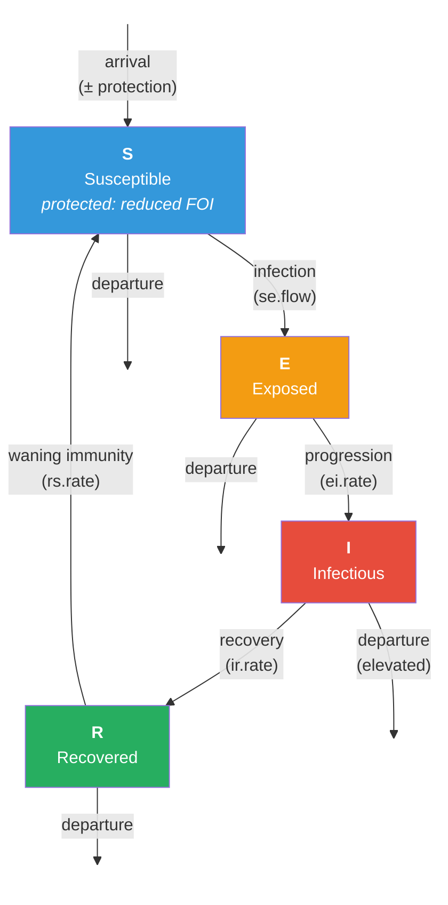

# SEIRS Model with Leaky Vaccination and Vital Dynamics

## Description

This example demonstrates how to model a **leaky vaccination** intervention on an SEIRS epidemic over a dynamic network with vital dynamics (arrivals and departures). In a leaky vaccine model, protected individuals are **not fully immune** — instead, they face a **reduced probability of infection** determined by the vaccine efficacy. This contrasts with the all-or-nothing (AON) model where protected individuals are completely immune.

Leaky vaccines are the more realistic model for many real-world vaccines (e.g., influenza, pertussis, COVID-19) where protection reduces the likelihood of infection but does not eliminate it. The key parameter is `vaccine.efficacy` (ψ): a protected individual's transmission probability is reduced to `(1 - ψ) × inf.prob`. With 80% efficacy, a protected individual faces only 20% of the baseline transmission risk per act.

This example also uses a **SEIRS** disease model with waning natural immunity (R → S), creating endemic dynamics where the disease persists indefinitely. Importantly, vaccine protection **persists through the SEIRS cycle**: if a protected individual is infected, progresses through E → I → R → S, they retain their protection attribute and benefit from reduced transmission probability again upon re-entering the susceptible pool.

## Model Structure

### Disease Compartments

| Compartment | Label | Description |
|-------------|-------|-------------|
| Susceptible | **S** | Not infected; at risk (includes vaccine-protected with reduced FOI) |
| Exposed | **E** | Infected but not yet infectious (latent period) |
| Infectious | **I** | Infected and capable of transmitting |
| Recovered | **R** | Recovered with temporary natural immunity |

Note: Unlike the AON model, there is no separate "V" compartment. Vaccine-protected individuals remain in S with a reduced force of infection.

### Flow Diagram



### Leaky Vaccine Mechanism

The leaky vaccine modifies the **infection module** rather than using a separate compartment:

1. For each discordant edge, the infection module checks whether the susceptible partner has vaccine protection.
2. If protected: `transProb = (1 - vaccine.efficacy) × inf.prob`
3. If unprotected: `transProb = inf.prob`
4. The per-timestep probability is then `1 - (1 - transProb)^act.rate`

This means vaccine protection is probabilistic at every exposure event, not binary. Over many exposures, even a highly effective leaky vaccine allows some breakthrough infections.

### AON vs. Leaky Comparison

| Feature | All-or-Nothing | Leaky |
|---------|---------------|-------|
| Protection type | Complete immunity | Reduced transmission probability |
| Compartment | Separate V compartment | Remains in S |
| Breakthrough infections | Impossible for protected | Possible at reduced rate |
| Implementation | Exclude from discordant edgelist | Modify transProb per edge |
| Disease model | SEIR (permanent immunity) | SEIRS (waning immunity) |

### Vaccination Routes

Same three-route vaccination cascade as the AON model:

| Route | When | Rate Parameters |
|-------|------|----------------|
| Initialization | Timestep 2 only | `vaccination.rate.initialization`, `protection.rate.initialization` |
| Progression | Every timestep | `vaccination.rate.progression`, `protection.rate.progression` |
| Arrivals | At birth | `vaccination.rate.arrivals`, `protection.rate.arrivals` |

Key assumptions:
- **One-shot vaccination**: Individuals can only be vaccinated once
- **Persistent protection**: Vaccine protection survives the SEIRS cycle (E → I → R → S → still protected)
- **No natural immunity boost**: Natural infection does not enhance or replace vaccine protection

## Network Model

Simple edges-only formation model:

- **`edges`** (target: 200): Mean degree 0.8 in a 500-node network
- Partnership duration: 50 weeks (~1 year)
- `d.rate` in `dissolution_coefs` adjusts for population turnover
- `resimulate.network = TRUE` because population size changes with vital dynamics

## Modules

### Infection Module (`infect`)

Replaces EpiModel's built-in infection module to implement **heterogeneous transmission probabilities** based on vaccine protection status. For each discordant edge, checks whether the susceptible partner has vaccine protection. Protected susceptibles face `(1 - vaccine.efficacy) × inf.prob`; unprotected susceptibles face the full `inf.prob`. Uses a merge operation to map protection status onto the discordant edgelist.

### Disease Progression Module (`progress`)

Simulates E → I (at `ei.rate`), I → R (at `ir.rate`), and R → S (at `rs.rate`). The R → S transition represents waning natural immunity, creating endemic SEIRS dynamics.

### Departure Module (`dfunc`)

Simulates mortality with disease-induced excess. All nodes face `departure.rate`; infected individuals face `departure.rate × departure.disease.mult`.

### Arrival Module (`afunc`)

Simulates arrivals and all three vaccination routes. At timestep 2 (EpiModel convention), initializes `vaccination` and `protection` attributes for the starting population. Each subsequent timestep: (1) vaccination progression for unvaccinated nodes, (2) Poisson arrivals with optional vaccination at birth. Vaccination and protection tracking uses character attributes ("initial", "progress", "arrival", "none") to record the source of each individual's vaccination.

## Parameters

### Transmission

| Parameter | Description | Default |
|-----------|-------------|---------|
| `inf.prob` | Per-act transmission probability (unprotected) | 0.5 |
| `act.rate` | Acts per partnership per week | 1 |
| `vaccine.efficacy` | Reduction in transmission for protected (0–1) | 0.8 |

### Disease Progression (SEIRS)

| Parameter | Description | Default |
|-----------|-------------|---------|
| `ei.rate` | E → I rate (mean latent ~20 weeks) | 0.05 |
| `ir.rate` | I → R rate (mean infectious ~20 weeks) | 0.05 |
| `rs.rate` | R → S rate (mean immune ~20 weeks) | 0.05 |

### Vital Dynamics

| Parameter | Description | Default |
|-----------|-------------|---------|
| `departure.rate` | Baseline weekly mortality rate | 0.008 |
| `departure.disease.mult` | Mortality multiplier for infected | 2 |
| `arrival.rate` | Per-capita weekly birth rate | 0.01 |

### Vaccination (Leaky)

| Parameter | Description | No Vax | Leaky Vax |
|-----------|-------------|--------|-----------|
| `vaccination.rate.initialization` | Initial population vaccination rate | 0 | 0.05 |
| `protection.rate.initialization` | Protection rate for initial vaccinees | 0 | 0.8 |
| `vaccination.rate.progression` | Weekly campaign vaccination rate | 0 | 0.05 |
| `protection.rate.progression` | Protection rate for campaign vaccinees | 0 | 0.8 |
| `vaccination.rate.arrivals` | Newborn vaccination rate | 0 | 0.6 |
| `protection.rate.arrivals` | Protection rate for vaccinated newborns | 0 | 0.8 |

### Network

| Parameter | Description | Default |
|-----------|-------------|---------|
| Population size | Number of nodes | 500 |
| Mean degree | Average concurrent partnerships | 0.8 |
| Partnership duration | Mean edge duration (weeks) | 50 |

## Module Execution Order

```
resim_nets → departures → arrivals → infection → progress → prevalence
```

Departures and arrivals run before infection so the network reflects the current population when transmission is simulated. Infection runs before progression so newly exposed individuals don't immediately progress in the same timestep.

## Scenarios

| Scenario | Vaccination | Expected Outcome |
|----------|-------------|-----------------|
| No vaccination | All rates = 0, efficacy = 0 | SEIRS endemic equilibrium |
| Leaky vaccination | High rates, 80% efficacy | Reduced but not eliminated transmission |

## Next Steps

- **Compare with AON vaccination** — see [SEIR with All-or-Nothing Vaccination](../seir-aon-vaccination) for the alternative model where protection is binary (immune or not)
- **Add waning vaccine protection** by implementing a time-dependent reduction in `vaccine.efficacy` or a stochastic loss of protection status
- **Vary vaccine efficacy** across a range (e.g., 0.2 to 0.95) to map the dose-response relationship between efficacy and population-level impact
- **Implement risk-based vaccination** by targeting vaccination to high-degree nodes or other network-based risk factors
- **Add a second dose or booster** by allowing re-vaccination of previously vaccinated individuals
- **Combine with age structure** — see [SI with Vital Dynamics](../si-vital-dynamics) for age-specific modules that could target vaccination by age group

## Author

Connor M. Van Meter, Emory University
