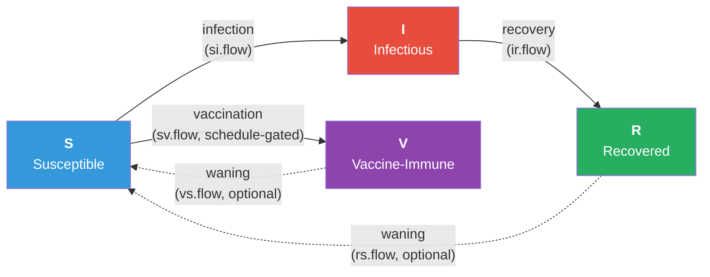

# SIR Model with Time-Varying (Phased) Vaccination

## Description

This example demonstrates how to model interventions that **activate, deactivate, or change intensity at specific timesteps**, rather than running uniformly from the start of the simulation. The custom `vaccinate` module reads an activation schedule from the parameter set and applies vaccination only when the schedule says it is active.

Two scheduling styles are supported with no code changes:

- **Windowed schedules**: parallel vectors of (start, end) timesteps. Handles a single campaign, a bounded short campaign, or any number of discrete pulses.
- **Reactive (state-dependent) schedules**: activate when current prevalence crosses an upper threshold, deactivate only when it falls below a lower threshold. The two thresholds create hysteresis so the program does not flap on/off rapidly.

Five scenarios share identical disease parameters and the same per-timestep vaccination rate on a closed SIR model; they differ only in their activation schedule. Two further scenarios switch on slow waning of natural and vaccine immunity, converting the model to SIRS so the reactive program has something to keep responding to over a long horizon --- and producing **sustained on/off cycling** that is the most striking phenomenon in this example.

## Model Structure

### Disease Compartments

| Compartment | Label | Description |
|-------------|-------|-------------|
| Susceptible | **S** | Not infected; at risk of exposure |
| Infectious | **I** | Infected and can transmit to contacts |
| Recovered | **R** | Recovered from infection; immune (permanent if `rs.rate = 0`) |
| Vaccine-immune | **V** | Vaccinated and protected (permanent if `vax.wane = 0`) |

### Flow Diagram



Solid arrows are the closed-SIR flows. The dashed waning arrows are off by default (`rs.rate = vax.wane = 0`) and switched on for the endemic SIRS scenarios.

### Time-Varying Intervention Pattern

The pedagogical core of this example is a small, reusable code pattern. Inside the vaccination module the per-timestep vaccination rate is gated by a schedule check:

```r
# Windowed: active if `at` lies in any (start, end) window
vax.active <- any(at >= vax.starts & at <= vax.ends)

# Reactive: hysteresis-based activation on prevalence
if (prev.active == 1) {
  vax.active <- current.prev > vax.prev.off
} else {
  vax.active <- current.prev > vax.prev.on
}
```

The same pattern generalizes to any time-varying or state-dependent intervention, including time-limited treatment programs, capacity-constrained testing, or seasonal control measures.

## Modules

### Infection Module (`infect`)

Standard S to I transmission along discordant edges, plus an optional `import.rate` parameter for exogenous (external) introductions. Vaccine-immune individuals are excluded automatically because `discord_edgelist()` only pairs `"s"` with `"i"`. Records `si.flow` and `im.flow`.

### Recovery Module (`recov`)

Two flows: I to R at `rec.rate`, plus an optional R to S waning of natural immunity at `rs.rate`. With `rs.rate = 0` the model is SIR; with `rs.rate > 0` it becomes SIRS, which is what makes the endemic scenarios possible. Records `ir.flow`, `rs.flow`, and `r.num`.

### Vaccination Module (`vaccinate`)

Schedule-driven all-or-nothing vaccination. Each timestep:

1. Apply optional vaccine waning (V to S) at `vax.wane`. Reset `vax.attempted` for newly waned individuals so they can be re-vaccinated.
2. Decide whether the program is active via either the windowed schedule (`vax.starts` / `vax.ends`) or the reactive schedule (`vax.prev.on` / `vax.prev.off`, with hysteresis).
3. If active, draw a Bernoulli trial at rate `vax.rate` for each eligible susceptible and apply all-or-nothing protection at `vax.efficacy`.

Records `vax.active` (0/1 indicator), `vax.flow`, `sv.flow`, `vs.flow`, and `v.num`.

## Parameters

### Disease

| Parameter | Description | Default |
|-----------|-------------|---------|
| `inf.prob` | Per-act transmission probability | 0.10 |
| `act.rate` | Acts per partnership per timestep | 1 |
| `rec.rate` | Per-timestep recovery rate | 0.04 |
| `rs.rate` | R-to-S waning rate (`0` = SIR; `> 0` = SIRS) | 0 |
| `import.rate` | Per-S probability of exogenous import per step | 0 |

### Vaccination

| Parameter | Description | Default |
|-----------|-------------|---------|
| `vax.rate` | Per-S vaccination probability per active timestep | 0.05 |
| `vax.efficacy` | All-or-nothing protection probability | 0.9 |
| `vax.wane` | V-to-S waning rate | 0 |

### Schedule

| Parameter | Description | Disabled |
|-----------|-------------|----------|
| `vax.starts` | Vector of window start timesteps | `-1` |
| `vax.ends` | Vector of window end timesteps | `-1` |
| `vax.prev.on` | Reactive activation threshold | `-1` |
| `vax.prev.off` | Reactive deactivation threshold | `-1` |

Reactive mode is selected when `vax.prev.on > 0`. Otherwise the module uses the windowed schedule.

### Network

| Parameter | Description | Default |
|-----------|-------------|---------|
| Population size | Number of nodes | 500 |
| Target edges | Mean concurrent partnerships | 375 (mean degree = 1.5) |
| Partnership duration | Mean edge duration (timesteps) | 60 |

## Module Execution Order

```
resim_nets -> summary_nets -> infection -> recovery -> vaccinate -> nwupdate -> prevalence
```

EpiModel's default pipeline. Custom modules (`infect`, `recov`, `vaccinate`) replace the corresponding built-in slots; the built-in `prevalence.net` fills in `s.num`, `i.num`, and `num` from the updated status vector.

## Scenarios

The run script compares seven scenarios that all share the same disease and vaccine parameters and differ in the activation schedule and waning configuration.

### Closed SIR (single epidemic wave)

| Scenario | Configuration | Teaching point |
|----------|---------------|----------------|
| No vaccination | `vax.rate = 0` | Counterfactual baseline |
| Early | `vax.starts = 30` | Catches the susceptible pool before transmission accelerates |
| Late | `vax.starts = 100` | Vaccinates residual susceptibles after the peak |
| Pulses | `vax.starts = c(40, 120)`, `vax.ends = c(70, 150)` | Multiple discrete windows |
| Reactive | `vax.prev.on = 0.05`, `vax.prev.off = 0.02` | State-dependent activation with hysteresis |

### Endemic SIRS (sustained dynamics, longer horizon)

| Scenario | Configuration | Teaching point |
|----------|---------------|----------------|
| Endemic counterfactual | `rs.rate = 0.015`, `vax.wane = 0.03`, no vaccination | Establishes the sustained endemic baseline |
| Endemic + Reactive | Same waning + reactive vaccination | Sustained on/off cycling --- the headline phenomenon |

The endemic comparison is the most striking result of the example: the reactive program toggles on and off many times across the long horizon, keeping prevalence below the activation threshold while the no-intervention counterfactual oscillates around ~10% prevalence indefinitely.

## Next Steps

- **Combine timing with the leaky vaccine mechanism** by adapting the schedule pattern to the leaky-vaccine example. See [SEIRS with Leaky Vaccination](../seirs-leaky-vaccination).
- **Phase a testing or treatment intervention** instead of vaccination. The same windowed/reactive pattern can wrap any rate parameter. See [Test and Treat Intervention](../sis-test-and-treat).
- **Time-vary the disease parameters themselves**, e.g. seasonal `inf.prob`. Apply the same `at`-dependent gate inside the infection module.
- **Combine windowed and reactive logic**: a planned campaign that can be extended if prevalence remains above a threshold.
- **Layer onto a model with vital dynamics** so vaccination must keep up with the inflow of new susceptibles. See [SEIR with AON Vaccination](../seir-aon-vaccination).

## Author

Samuel M. Jenness, Emory University (http://samueljenness.org/)
