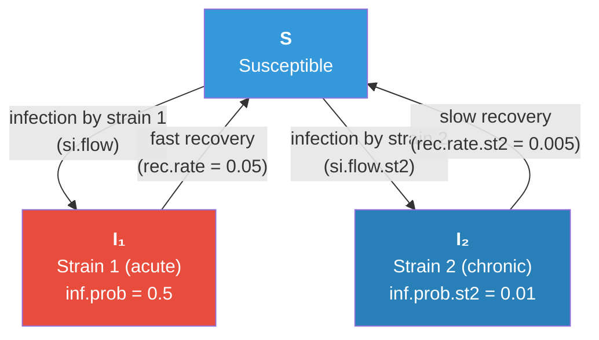

# Modeling Two Competing Strains in an SIS Epidemic

## Description

This example models an SIS epidemic with **two competing pathogen strains** that differ in their transmission strategy: one is highly infectious but short-lived (an "acute" strain), while the other has low infectiousness but persists for much longer (a "chronic" strain). This trade-off between infectiousness and duration is common in real pathogens — for example, gonorrhea vs. chlamydia, or different variants of the same pathogen.

The central question: **which transmission strategy wins?** The answer depends critically on the network structure — specifically, whether **concurrency** (simultaneous partnerships) is allowed. Concurrency amplifies transmission by allowing an infected individual to spread the pathogen to a new partner before the existing partnership ends, creating branching chains of transmission. This benefits the fast-spreading acute strain disproportionately.

This example demonstrates how to extend EpiModel's infection and recovery modules to track multiple strains, and how network structure (not just individual-level parameters) can determine epidemic outcomes.

## Model Structure

### Disease Compartments

| Compartment | Label | Description |
|-------------|-------|-------------|
| Susceptible | **S** | Not infected; at risk of infection by either strain |
| Infectious (Strain 1) | **I₁** | Infected with the acute strain (high transmission, fast recovery) |
| Infectious (Strain 2) | **I₂** | Infected with the chronic strain (low transmission, slow recovery) |

### Flow Diagram



### SIS Dynamics with Two Strains

This is an SIS model — recovered individuals return to the susceptible pool and can be reinfected by either strain. The two strains compete for the same pool of susceptible hosts. Key dynamics:

- **Competitive exclusion**: In many parameter regimes, one strain dominates and drives the other to extinction. The strains compete indirectly — by infecting susceptibles, each strain reduces the pool available to the other.
- **Coexistence is possible** at intermediate concurrency levels, where both strains maintain endemic equilibria simultaneously.
- **No co-infection**: An individual can only be infected with one strain at a time. On recovery, they become fully susceptible to both strains again.
- **Strain inheritance**: Newly infected individuals inherit the strain of their infecting partner. There is no mutation or recombination.

### Why Concurrency Matters

The two network models have identical mean degree, partnership duration, and act rates. The only difference is whether concurrency is allowed. Yet this structural difference reverses which strain dominates:

- **With concurrency**: The acute strain (high `inf.prob`, fast recovery) can exploit branching transmission chains. An infected individual with 2+ partners can transmit to a new partner before recovering, even with a short infectious period. The fast transmission rate dominates.
- **Without concurrency (monogamy)**: Partners are sequential. The acute strain's high per-act probability provides little advantage because transmission to each new partner must wait for the previous partnership to dissolve. The chronic strain's long infectious duration means it persists across multiple sequential partnerships, giving it the advantage.

## Network Models

Two formation models are compared, both targeting 300 edges (mean degree 0.6) with 50-week partnership duration:

| Model | Formation | Concurrency | Description |
|-------|-----------|-------------|-------------|
| Model 1 | `~edges` | Allowed (~120 nodes) | Random network; some nodes naturally have 2+ ties |
| Model 2 | `~edges + concurrent` | Prohibited (0 nodes) | Strict monogamy; no node has more than 1 tie |

## Modules

### Strain Initialization Module (`init_strain`)

Runs once at the first module call. Assigns each initially infected node to strain 1 or strain 2 via a Bernoulli draw with probability `pct.st2`. Susceptible nodes receive `strain = NA`. Uses `override.null.error = TRUE` to detect first run.

### Two-Strain Infection Module (`infection.2strains`)

Replaces EpiModel's built-in `infection.net` to implement strain-specific transmission. For each discordant edge, the per-act transmission probability is determined by the infected partner's strain (`inf.prob` for strain 1, `inf.prob.st2` for strain 2). Both parameters can be time-varying vectors indexed by infection duration. Newly infected individuals inherit the infecting partner's strain. When multiple infections target the same susceptible in one timestep, the first infector (by edgelist order) determines the strain. Records strain-specific incidence (`si.flow`, `si.flow.st2`) and prevalence (`i.num.st1`, `i.num.st2`).

### Two-Strain Recovery Module (`recov.2strains`)

Replaces EpiModel's built-in recovery module to implement strain-dependent recovery rates. Strain 1 recovers at `rec.rate`, strain 2 at `rec.rate.st2`. On recovery, both disease status and strain assignment are cleared. Records strain-specific recovery flows (`is.flow.st1`, `is.flow.st2`).

## Parameters

### Transmission

| Parameter | Description | Default |
|-----------|-------------|---------|
| `inf.prob` | Per-act transmission probability (strain 1) | 0.5 |
| `inf.prob.st2` | Per-act transmission probability (strain 2) | 0.01 |
| `act.rate` | Acts per partnership per week | 2 |

### Recovery

| Parameter | Description | Default |
|-----------|-------------|---------|
| `rec.rate` | Recovery rate, strain 1 (mean ~20 weeks) | 0.05 |
| `rec.rate.st2` | Recovery rate, strain 2 (mean ~200 weeks) | 0.005 |

### Strain Initialization

| Parameter | Description | Default |
|-----------|-------------|---------|
| `pct.st2` | Probability initial infection is strain 2 | 0.5 |

### Optional Intervention

| Parameter | Description | Default |
|-----------|-------------|---------|
| `inter.eff` | Intervention efficacy (reduces transmission by this factor) | Not set |
| `inter.start` | Timestep when intervention begins | Not set |

### Network

| Parameter | Description | Default |
|-----------|-------------|---------|
| Population size | Number of nodes | 1000 |
| Target edges | Mean concurrent partnerships | 300 |
| Concurrency | Varies by model (0 or ~120) | — |
| Partnership duration | Mean edge duration (weeks) | 50 |

## Module Execution Order

```
resim_nets → initStrain → infection → recovery → prevalence
```

The `initStrain` module runs first (but only operates at the first timestep). Infection runs before recovery so that newly infected individuals can be tracked before any recovery occurs in the same timestep.

## Scenarios

The run script compares two network structures to demonstrate how concurrency determines the outcome of strain competition:

| Scenario | Concurrency | Expected Outcome |
|----------|-------------|-----------------|
| Model 1 (random) | Allowed (~120 nodes) | Strain 1 (acute) dominates; strain 2 may go extinct |
| Model 2 (monogamy) | Prohibited (0 nodes) | Strain 2 (chronic) dominates; strain 1 goes extinct |

An interactive sensitivity analysis sweeps concurrency from 0 to 120, plotting the full crossover curve. The transition occurs at approximately 70 concurrent nodes.

## Next Steps

- **Add co-infection**: Allow individuals to carry both strains simultaneously, introducing within-host competition and superinfection dynamics
- **Model strain mutation**: Allow strain 1 to mutate into strain 2 (or vice versa), exploring the evolution of virulence
- **Add vital dynamics**: Introduce births and deaths to study longer-term strain competition — see [SI with Vital Dynamics](../si-vital-dynamics)
- **Vary the trade-off**: Explore different points on the infectiousness-duration trade-off curve to map the full parameter space of competitive outcomes
- **Add a treatment intervention**: Differential treatment efficacy across strains connects to antimicrobial resistance — see [Test and Treat](../sis-test-and-treat)
- **Extend to three or more strains**: Generalize the framework to model multi-strain competition with more complex fitness landscapes

## Author

Steven M. Goodreau, University of Washington (http://faculty.washington.edu/goodreau)
