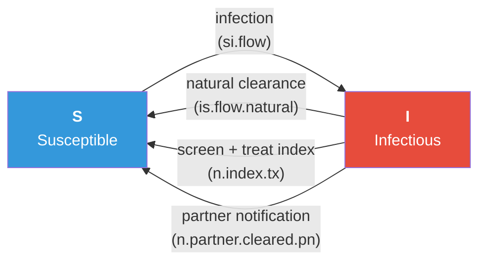

# Partner Notification for an Endemic STI

## Description

This example demonstrates how to build a **partner notification (PN) intervention** for an endemic bacterial STI (chlamydia-like), modeled as an SIS process on a dynamic sexual contact network. Indices are detected by routine screening; a custom `partner_services` module looks each index's recent partners up in the cumulative edgelist and either Patient Referral (PR) or Expedited Partner Therapy (EPT) routes them through treatment.

The pedagogical core is the **cumulative-edgelist API**: `get_partners()`, `get_posit_ids()`, `get_unique_ids()`, and the three `control.net()` flags that turn the engine on. Once a custom module can ask "who were this person's partners in the last 60 weeks?", any partner-based intervention is a matter of choosing what to do with the returned set.

Five scenarios share the same network and disease parameters and differ only in the PN configuration:

| Scenario | `pn.arm` | `pn.trace.prob` | `pn.lookback` |
|----------|----------|-----------------|---------------|
| Screening only | `"none"` | 0 | n/a |
| Patient Referral | `"PR"` | 0.5 | 60 |
| EPT | `"EPT"` | 0.5 | 60 |
| EPT, longer lookback | `"EPT"` | 0.5 | 120 |
| EPT, high trace + long lookback | `"EPT"` | 0.8 | 120 |

## Model Structure

### Disease Compartments

| Compartment | Label | Description |
|-------------|-------|-------------|
| Susceptible | **S** | Not infected; at risk and reinfectable |
| Infectious | **I** | Infected and transmitting |

### Flow Diagram



Three return paths from `I` to `S`: slow natural clearance, treatment of screened-positive indices, and treatment of notified partners under the active PN arm.

### Auxiliary Node Attributes

| Attribute | Type | Purpose |
|-----------|------|---------|
| `diag.status` | 0/1 | Sticky: 1 if the node was ever diagnosed |
| `dx.time` | int | Step of most recent positive diagnosis |
| `dx.this.step` | 0/1 | Trigger for partner notification and index treatment in the current step |
| `tx.this.step` | 0/1 | Whether the node received any treatment this step (index or notified partner) |
| `pn.notified` | int | Step at which the node was most recently notified as a partner |
| `infections` | int | Running count of S to I transitions for reinfection analysis |

## The Cumulative Edgelist Pattern

Three flags on `control.net()`:

```r
control.net(
  ...,
  cumulative.edgelist      = TRUE,        # turn the engine on
  truncate.el.cuml         = max.lookback,# drop edges older than this
  save.cumulative.edgelist = TRUE         # attach to returned sim
)
```

Inside `partner_services()`:

```r
idsIndex <- which(active == 1 & dx.this.step == 1)
part_df  <- get_partners(dat, idsIndex,
                         truncate          = pn.lookback,
                         only.active.nodes = TRUE)

# get_partners returns UNIQUE IDs in the `partner` column. Convert to
# positional IDs before indexing into per-node vectors.
partner_pid <- get_posit_ids(dat, part_df$partner)
partner_pid <- partner_pid[!is.na(partner_pid)]
```

The unique-vs-positional ID round-trip is the most common stumbling block of the cumulative-edgelist API. Per-node vectors in `dat` (status, active, all attributes) are indexed by **positional ID**. The `partner` column of `get_partners()` is in **unique-ID** space, because past partners may have departed the population and no longer have a positional ID. Convert before doing anything else.

## Modules

### Screening Module (`screen`)

Routine screening of infected actives at rate `screen.rate` per timestep. A positive sets `dx.this.step = 1` (the PN trigger), stamps `dx.time = at`, and sets `diag.status = 1`. The `diag.status` flag is sticky across the run, persisting after later clearance. Initializes all custom attributes at `at == 2`.

### Partner Notification Module (`partner_services`)

The headline module. Identifies fresh-positive indices, calls `get_partners()` with the configured lookback, converts unique IDs to positional IDs, applies a Bernoulli trace at `pn.trace.prob`, and stamps reached partners with `pn.notified = at`. Records `n.partners.elig` and `n.partners.reached` per step.

### Treatment Module (`treat`)

Two pathways. Indices (`dx.this.step == 1`) are always treated at `tx.efficacy`. Notified partners (`pn.notified == at`) are handled per `pn.arm`:

- `"none"`: nothing.
- `"PR"`: test the partner at sensitivity `pn.test.prob`, then treat at `tx.efficacy` if positive. Uninfected partners are not treated.
- `"EPT"`: dispense medication directly at `ept.efficacy`. Treats both infected and uninfected partners; uninfected treatment is counted as a wasted dose but has no epidemic effect.

Records `n.index.tx`, `n.partner.tx`, `n.partner.tx.wasted`, `n.partner.cleared.pn` per step.

### Recovery Module (`recov`)

Slow natural clearance I to S at `rec.rate`. Records `is.flow.natural`.

### Infection Module (`infect`)

Standard discordant-edge transmission. Increments a per-node `infections` counter on every fresh S to I for reinfection analysis. Records `si.flow`.

## Parameters

### Transmission and Recovery

| Parameter | Description | Default |
|-----------|-------------|---------|
| `inf.prob` | Per-act transmission probability | 0.18 |
| `act.rate` | Acts per partnership per week | 1 |
| `rec.rate` | Weekly natural clearance rate | 0.02 (mean ~50 wk) |

### Screening and Treatment

| Parameter | Description | Default |
|-----------|-------------|---------|
| `screen.rate` | Weekly probability of screening for an infected | 0.025 |
| `tx.efficacy` | Probability a treated index clears | 0.95 |
| `ept.efficacy` | Probability a partner takes EPT meds and clears | 0.85 |
| `pn.test.prob` | Sensitivity of the PR returning-partner test | 0.85 |

### Partner Notification

| Parameter | Description | Varied |
|-----------|-------------|--------|
| `pn.arm` | `"none"`, `"PR"`, `"EPT"` | Yes |
| `pn.trace.prob` | Bernoulli probability a partner is reached | 0, 0.5, 0.8 |
| `pn.lookback` | Weeks of lookback on the cumulative edgelist | 60 or 120 |
| `pn.start` | Step at which PN switches on after burn-in | 300 |

### Network

| Parameter | Description | Default |
|-----------|-------------|---------|
| Population size | Number of nodes | 1000 |
| Mean degree | Edges per node | 1.2 |
| Concurrency | Nodes with degree > 1 | ~18% |
| Partnership duration | Mean edge duration (weeks) | 100 |

## Module Execution Order

```
resim_nets -> summary_nets -> infection -> screen -> partner_services ->
   treat -> recovery -> nwupdate -> prevalence
```

`screen` runs first so this step's fresh indices are visible to the downstream modules. `partner_services` reads them, queries the cumulative edgelist, and stamps notifications. `treat` reads both `dx.this.step` (indices) and `pn.notified == at` (partners) and applies the arm-specific cascade. `recovery` handles slow natural clearance.

## Caveats

`pn.lookback = 60` weeks is much longer than the real CDC guidance (60 days for chlamydia/gonorrhea). The partnership durations and act rates here are tuned for clean endemic-equilibrium teaching, not for calibrating to U.S. chlamydia surveillance data. Treat all numbers as illustrative.

## Next Steps

- Add a clinic-visit delay between index diagnosis and partner outreach.
- Stratify trace rate by partnership type (main vs. casual) via a multilayer network and the `networks` argument of `get_partners()`.
- Allow re-notification of partners who were notified earlier but never treated.
- Replace EPT efficacy with a recency-dependent stochastic uptake decision, modeled from the `start` column of `get_partners()`.
- Pair with a contact-tracing example for a respiratory pathogen sharing the same API.

## Author

Samuel M. Jenness, Emory University (http://samueljenness.org/)
