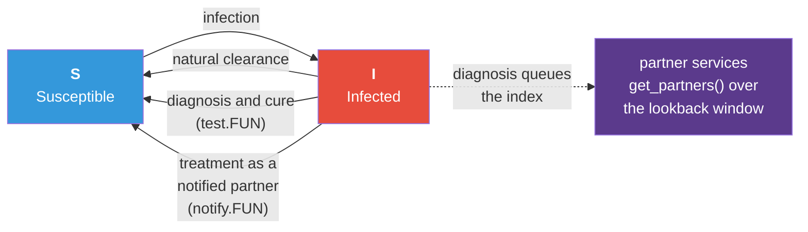

# Partner Notification for an Endemic Bacterial STI

## Description

This example demonstrates **partner notification as a network intervention** for a chlamydia-like infection that leaves no immunity (SIS). The population is heterosexual young adults with main and casual partnership layers, a small high-activity group, and arrivals and departures. Screening and symptom-driven care find infections; every diagnosed case is queued for partner services, and a custom `notify` module finds the case's partners from the last weeks through EpiModel's **cumulative edgelist**, across both layers, and treats the ones it reaches under one of two arms: patient referral (PR), in which partners come in the following week and are tested, so infected partners become indices in turn, or expedited partner therapy (EPT), in which partners take medication delivered by the index the same week and are never tested.

The pedagogical core is the cumulative-edgelist API in an open, multilayer population: `get_partners()` with a fixed `truncate` window, the `network` and `stop` columns that set each partner's chance of being reached, `only.active.nodes = TRUE` for partners who have left the population, and the unique-to-positional id round trip with `get_posit_ids()`, which carries weight here because `tergmLite` deletes departed nodes and shifts positional ids. The example also shows a burn-in to endemic equilibrium that every scenario resumes with `control.net(start = ...)`, and a repeat infection record that asks the cumulative edgelist when the transmitting partnership began. The [Contact Tracing](../seir-contact-tracing) example uses the same API for an acute, immunizing infection; the two are meant to be read together. The canonical version of this example is the Quarto page.

## Model Structure

| Status | Description |
|---|---|
| S | Susceptible; reinfection is possible at any time |
| I | Infected; symptomatic (`symp = 1`, 10% of infections in women and 20% in men) or asymptomatic |


```mermaid
flowchart LR
    S["<b>S</b><br/>Susceptible"] -->|"infection"| I["<b>I</b><br/>Infected"]
    I -->|"natural clearance"| S
    I -->|"diagnosis and cure<br/>(test.FUN)"| S
    I -->|"treatment as a<br/>notified partner<br/>(notify.FUN)"| S
    I -.->|"diagnosis queues<br/>the index"| PN["partner services<br/>get_partners() over<br/>the lookback window"]

    style S fill:#3498db,color:#fff
    style I fill:#e74c3c,color:#fff
    style PN fill:#5b3a8c,color:#fff
```

## The Partner Notification Pattern

Inside the `notify` module:

```r
# Indices: everyone queued for partner services
idsIndex <- which(active == 1 & pn.pending == 1)

# Partners from the last pn.lookback weeks, both layers. Rows carry index and
# partner as unique ids, start, stop (NA while ongoing), and network.
part_df <- get_partners(dat, idsIndex, truncate = pn.lookback,
                        only.active.nodes = TRUE)

# Unique ids back to positional ids before indexing any attribute vector
part_df$pid <- get_posit_ids(dat, part_df$partner)

# Reach set by partnership type: ongoing main, ongoing casual, or ended
type <- ifelse(!is.na(part_df$stop), "ended",
               ifelse(part_df$network == 1, "main", "cas"))
reached <- rbinom(nrow(part_df), 1, reach[type]) == 1
```

`truncate = K` returns ongoing partnerships plus those last active within `K` steps: 9 weeks for the CDC's 60 days, 26 for six months, 0 for ongoing partnerships only. `truncate.el.cuml` in `control.net()` must be at least the longest window any module asks for; it is 52 weeks here so the analysis can also count partners over the past year.

## Modules

| Module | Role |
|---|---|
| `init_attrs` | One-shot setup of `symp`, `dx.time`, `tx.time`, `pn.pending`, `pr.visit` |
| `infect` | S to I over the discordant pairs of both layers; for infections within 13 weeks of a cure, asks `get_partners(truncate = 0)` whether the transmitting partnership began before the cure |
| `test_treat` | Screening by sex and symptomatic care-seeking; cure; queues diagnosed cases for partner services |
| `notify` | The pattern above; EPT treats reached partners the same week, PR books them for the next week, tests them, and queues infected ones as new indices |
| `clear` | Natural clearance |
| `depart`, `arrive` | Departures at 1/520 per week and balancing arrivals; `sex` and `risk` of arrivals come from `attr.rules` |

Module order is set explicitly: `resim_nets -> summary_nets -> initAttr -> infection -> test -> notify -> recovery -> departures -> arrivals -> nwupdate -> prevalence`.

## Network and Parameters

Weekly steps, N = 10,000. Main partnerships: half the population in one at any time, none concurrent, 78 weeks. Casual partnerships: 8 weeks; mean casual degree 0.5 in a 10% high-activity group and 0.04 otherwise, with half of high-activity partnerships within the group. Both layers heterosexual through `offset(nodematch("sex"))`. The casual layer needs `set.control.tergm = control.simulate.formula.tergm(MCMC.burnin.min = 1e5)`: with the default Markov chain length it settles well below its targets at this population size.

| Parameter | Value | Meaning |
|---|---|---|
| `inf.prob` | 0.11 | weekly transmission probability per partnership (one act per week); tuned to about 3% prevalence |
| `rec.rate` | 1/70 | natural clearance, mean 70 weeks |
| `symp.prob.f`, `symp.prob.m`, `symp.test.rate` | 0.1, 0.2, 0.25 | symptomatic share by sex; weekly care-seeking of symptomatic infections |
| `screen.rate.f`, `screen.rate.m` | 40% and 8% per year | screening of asymptomatic infections |
| `tx.prob` | 0.95 | cure after treatment |
| `pn.lookback` | 9, 26, or 0 weeks | lookback window |
| `reach.main`, `reach.cas`, `reach.ended` | PR 0.45, 0.20, 0.10; EPT 0.65, 0.35, 0.15 | probability of reaching a partner by partnership type |

Sources and the calibration targets are on the Quarto page.

## Scenarios

A 10-year burn-in under screening and patient referral with a 60-day lookback is run once with `save.run = TRUE`, and each scenario resumes it for five years:

| Scenario | `pn.arm` | `pn.lookback` |
|---|---|---|
| No partner services | `"none"` | |
| Patient referral, 60 days (continues the burn-in) | `"PR"` | 9 |
| Patient referral, 6 months | `"PR"` | 26 |
| EPT, 60 days | `"EPT"` | 9 |
| EPT, ongoing partners only | `"EPT"` | 0 |

Outputs: a calibration table for the burn-in; prevalence and infections averted relative to patient referral, with Monte Carlo intervals from paired differences; repeat infection within 13 weeks of cure and the share caused by a partner the person already had when cured; partners found and reached per index by partnership type, the share infected, and partners diagnosed per index.

## Running

```bash
# Full settings (about five minutes on five cores)
Rscript model.R "run_full <- TRUE"

# CI settings (under a minute)
Rscript model.R
```

## Next Steps

- Abstinence until partners are treated, which the model lacks and which makes its repeat infection about twice the observed level.
- Offer EPT with patient referral as the fallback for indices who decline.
- Notify the most recent partner when no partnership falls in the window.
- Retest cured cases at three months.
