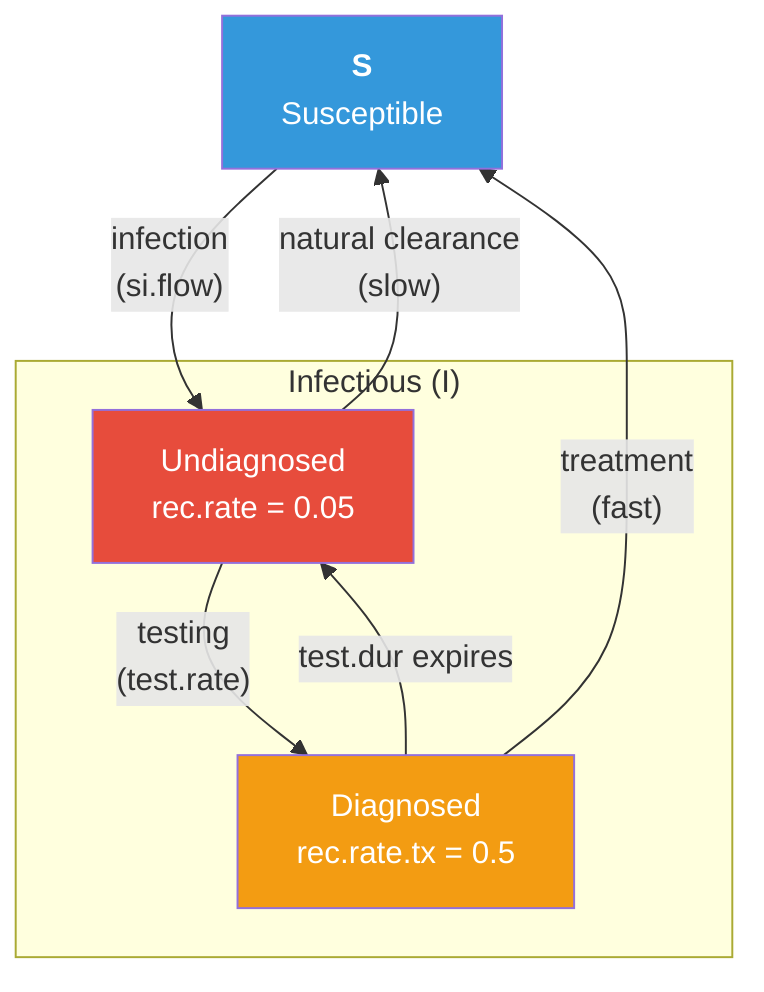

# Test and Treat Intervention for an SIS Epidemic

## Description

This example demonstrates how to build a **test-and-treat intervention** for a bacterial STI (e.g., gonorrhea) modeled as an SIS epidemic over a dynamic network. Many STIs are asymptomatic — infected individuals do not know they are infected without routine screening. Testing identifies infected individuals who then receive antibiotic treatment, dramatically accelerating recovery. The key question: **how much screening is needed to meaningfully reduce population-level prevalence?**

Unlike SIR models where recovered individuals gain immunity, the SIS framework allows reinfection — recovered individuals return to the susceptible pool and can be infected again. This creates an **endemic equilibrium** where new infections balance recoveries. Interventions that increase the recovery rate (like test-and-treat) shift this equilibrium to a lower prevalence.

This is the foundational intervention example in the Gallery. The techniques shown here — adding custom attributes for diagnosis status, implementing heterogeneous rates based on intervention status, and comparing intervention scenarios — are building blocks for more complex treatment cascade models.

## Model Structure

### Disease Compartments

| Compartment | Label | Description |
|-------------|-------|-------------|
| Susceptible | **S** | Not infected; at risk of infection (including previously recovered) |
| Infectious | **I** | Infected; can transmit to susceptible contacts |

Within the infectious compartment, individuals can be either **undiagnosed** (recovering slowly via natural clearance) or **diagnosed** (recovering quickly via antibiotic treatment).

### Flow Diagram



### SIS Dynamics

In an SIS model, recovered individuals immediately return to the susceptible pool (`status = "s"`). There is no immune compartment. This means:

- The epidemic can persist indefinitely (endemic equilibrium)
- Reinfection is possible and common
- Interventions must be sustained — unlike SIR vaccination, there is no herd immunity threshold

### Test-and-Treat Cascade

The intervention is implemented with two separate attributes so that "tested recently" and "diagnosed positive" are not conflated:

- `tested.status` flags individuals who tested recently (within the last `test.dur` timesteps), regardless of result. It gates re-testing eligibility.
- `diag.status` flags individuals who tested positive *and are infected*. It is the flag the recovery module reads to apply the faster treatment rate.

The three-step cascade:

1. **Testing**: Eligible individuals (active, not currently in a test window, not already on active treatment) test at rate `test.rate` per timestep. Testing is universal — both susceptibles and infecteds can test, and it does not require symptoms. Every tester gets `tested.status = 1` for `test.dur` timesteps.
2. **Positive diagnosis**: Only infected testers receive `diag.status = 1`. Susceptible testers got a negative result — they are marked as recently tested but do not enter the treatment pipeline.
3. **Treatment course**: Once positively diagnosed, the individual recovers at `rec.rate.tx` for up to `test.dur` timesteps. If still infected after that, the treatment course ends and they revert to the natural clearance rate until re-tested.

On recovery, `diag.status` is cleared (the individual is cured and exits the treatment pipeline).

## Network Model

The formation model uses three ERGM terms to create a realistic sexual contact network:

- **`edges`** (target: 175): Controls mean degree (0.7 concurrent partnerships per node)
- **`concurrent`** (target: 110): 22% of nodes have degree > 1 (overlapping partnerships), a key driver of STI transmission
- **`degrange(from = 4)`** (target: 0): No node has 4+ simultaneous partners, preventing unrealistically high-degree nodes

Partnership duration of 50 weeks (~1 year).

## Modules

### Test and Treat Module (`tnt`)

Initializes four attributes at timestep 2: `tested.status` / `tested.time` (track the test window for any tester) and `diag.status` / `diag.time` (track positive-diagnosis-and-on-treatment status). Each timestep: (1) stochastic testing of eligible individuals; (2) `tested.status = 1` for all testers; (3) `diag.status = 1` only for *infected* testers; (4) reset of both test and treatment windows once `test.dur` timesteps have elapsed. Records `nTest` (total tests, any result), `nDiagNew` (newly positive), `nRest` (test-window resets), and `nDiag` (current count on active treatment).

### Recovery Module (`recov`)

Replaces EpiModel's built-in recovery module to implement **heterogeneous recovery rates**. Diagnosed individuals (`diag.status == 1`) recover at `rec.rate.tx`, while undiagnosed individuals recover at the slower `rec.rate`. On recovery, both disease status and diagnosis status are cleared. Records I→S flows as `is.flow`.

### Infection Module (`infection.net`)

Uses EpiModel's built-in SI infection module unchanged. Transmission occurs along discordant edges with per-act probability `inf.prob` and `act.rate` acts per partnership per timestep.

## Parameters

### Transmission

| Parameter | Description | Default |
|-----------|-------------|---------|
| `inf.prob` | Per-act transmission probability | 0.4 |
| `act.rate` | Acts per partnership per timestep | 2 |

### Recovery and Treatment

| Parameter | Description | Default |
|-----------|-------------|---------|
| `rec.rate` | Natural clearance rate (undiagnosed) | 1/20 (mean ~20 weeks) |
| `rec.rate.tx` | Treatment recovery rate (diagnosed) | 0.5 (mean ~2 weeks) |

### Screening

| Parameter | Description | Varied |
|-----------|-------------|--------|
| `test.rate` | Weekly testing rate for undiagnosed individuals | 0 / 0.1 / 0.3 |
| `test.dur` | Duration diagnosis persists (timesteps) | 2 |

### Network

| Parameter | Description | Default |
|-----------|-------------|---------|
| Population size | Number of nodes | 500 |
| Target edges | Mean concurrent partnerships | 175 |
| Concurrency | Nodes with degree > 1 | 110 |
| Max degree | Upper bound on simultaneous partners | 3 |
| Partnership duration | Mean edge duration (weeks) | 50 |

## Module Execution Order

```
resim_nets → infection → tnt → recovery → prevalence
```

The `tnt` module runs after infection (so newly infected individuals can be tested in the same timestep) and before recovery (so newly diagnosed individuals immediately benefit from the higher treatment recovery rate).

## Scenarios

The run script compares three screening intensities to demonstrate the dose-response relationship between intervention effort and population-level impact:

| Scenario | `test.rate` | Mean test interval | Expected equilibrium |
|----------|-------------|-------------------|---------------------|
| No screening | 0 | Never | ~45% prevalence |
| Standard | 0.1 | ~10 weeks | ~30% prevalence |
| Intensive | 0.3 | ~3 weeks | ~8% prevalence |

An interactive sensitivity analysis sweeps `test.rate` from 0 to 0.5, plotting the full dose-response curve.

## Next Steps

- **Separate testing from treatment**: Add a treatment uptake probability or delay between diagnosis and treatment initiation — not all diagnosed individuals start treatment immediately
- **Add partner notification / contact tracing**: Diagnosed individuals' partners receive expedited testing, amplifying the intervention's reach
- **Risk-based screening**: Vary `test.rate` by individual attributes (e.g., higher-risk groups test more frequently)
- **Add vital dynamics** for longer-term STI modeling — see [SI with Vital Dynamics](../si-vital-dynamics)
- **Model antimicrobial resistance**: Introduce treatment failure or competing resistant strains — see [Competing Strains](../sis-competing-strains)
- **Extend to multi-stage disease**: Model progression through disease stages with stage-dependent testing and treatment — see [Syphilis](../syphilis)
- **Add cost-effectiveness analysis**: Attach costs to testing and treatment to evaluate intervention efficiency — see [Cost-Effectiveness Analysis](../cost-effectiveness)

## Author

Samuel M. Jenness, Emory University (http://samueljenness.org/)
