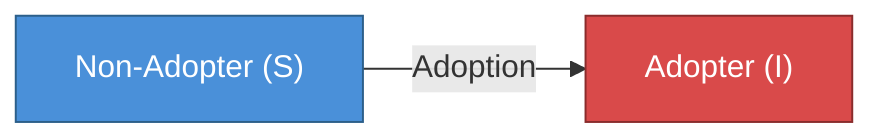
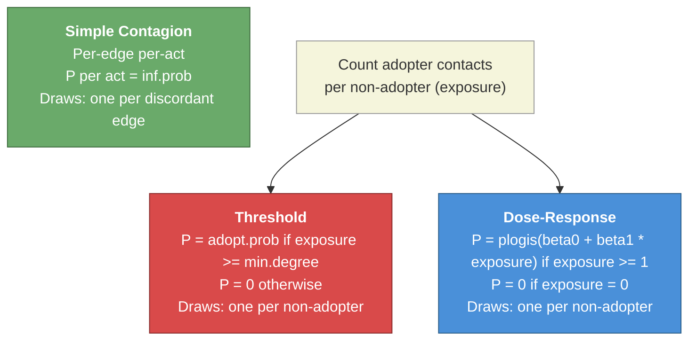

# Social Diffusion Model

## Authors
Samuel M. Jenness (Emory University)

## Description

This example demonstrates how EpiModel's SI (susceptible-infected) framework can be repurposed to model **social diffusion** -- the spread of ideas, behaviors, or technologies through a social network. Unlike infectious disease, social diffusion often exhibits **complex contagion**: adoption requires reinforcement from multiple contacts, not just exposure to a single carrier.

The model compares three diffusion mechanisms on the same network. The mechanisms differ in *what kind of hazard* drives adoption:

1. **Simple contagion** (baseline): a per-edge per-act hazard. Each adopter-non-adopter edge independently fires at probability `inf.prob` per act. EpiModel's built-in SI module. Equivalent to standard infectious disease transmission -- exposure has its effect through the number of independent contact events.
2. **Threshold diffusion**: a per-individual per-timestep hazard. Each non-adopter draws once per timestep, with probability `adopt.prob` if their current exposure (number of adopter contacts) meets a minimum threshold, and probability **zero** otherwise.
3. **Dose-response diffusion**: also a per-individual per-timestep hazard, with the probability rising smoothly with exposure via a logistic curve. Like the threshold model, exposure of zero gives probability zero -- diffusion requires exposure.

### Simple vs. Complex Contagion

In **simple contagion** (standard epidemic models), each adopter contact is an independent transmission opportunity, and the per-contact probability is the same regardless of how many other adopter contacts a person has. A non-adopter with more adopter contacts gets more independent chances. This works well for biological pathogens, where each exposure event can independently cause infection.

**Complex contagion** (Centola & Macy 2007; Granovetter 1978; Watts 2002) describes processes where adoption is an individual-level decision whose probability depends on the number of adopter contacts. One adoption draw per non-adopter per timestep, at a probability set by social context. Importantly, the literature treats exposure = 0 as adoption probability 0: a person cannot adopt a behavior they have never been exposed to through the network. Spontaneous adoption from outside the network ("innovation") is a separate process. Complex contagion captures:

- **Technology adoption**: "I'll switch to a new platform only if enough friends already use it"
- **Behavior change**: "I need multiple role models before I change my habits"
- **Collective action**: "I'll join the protest only if enough peers are committed"
- **Norm diffusion**: "I'll adopt a new norm only when it's clearly the local standard"

The key insight from this model: **the same network and same initial conditions produce dramatically different dynamics depending on the diffusion mechanism**. Complex contagion is slower to start but can produce sudden "tipping point" cascades once enough of the network is seeded.

## Model Structure

### Diffusion Flow

Adoption is permanent (SI dynamics -- no reversion to non-adopter status). The three scenarios differ only in how adoption probability is calculated.

### Adoption Probability by Mechanism

### Dose-Response Probability Curve

The logistic dose-response function with `beta0 = -5.0` and `beta1 = 1.5` produces these per-individual per-timestep adoption probabilities:

| Adopter Contacts | Log-Odds | P(adopt per timestep) |
|:---:|:---:|:---:|
| 0 | -- | 0 (excluded) |
| 1 | -3.5 | 0.029 |
| 2 | -2.0 | 0.119 |
| 3 | -0.5 | 0.378 |
| 4 | +1.0 | 0.731 |

Compare: simple contagion uses a per-edge per-act probability of 0.1 regardless of exposure (a non-adopter with N adopter contacts effectively gets N independent draws). The threshold model uses a per-individual probability of 0.5 when exposure >= 2 and 0 otherwise.

## Modules

### `diffuse_threshold` (Threshold Diffusion)

Replaces EpiModel's built-in infection module. Evaluates every active non-adopter once per timestep:

1. Compute **exposure** per non-adopter (count of adopter contacts at this timestep, 0 if none) via `tabulate` on the discordant edgelist.
2. Apply the **hard threshold rule** at the individual level: `p = adopt.prob` when exposure >= `min.degree`, else `p = 0`.
3. One Bernoulli draw per non-adopter (`rbinom(length(idsSus), 1, p)`) -- not one per edge. Exposure determines *whether* adoption is possible and at *what probability*, but not how many independent chances per timestep.

### `diffuse_dose_response` (Dose-Response Diffusion)

Same structure as the threshold module, but the per-individual adoption probability rises smoothly with exposure rather than via a step function:

1. Same exposure counting.
2. `p = plogis(beta0 + beta1 * exposure)` for `exposure >= 1`. Exposure = 0 gives `p = 0` (diffusion requires exposure).
3. One Bernoulli draw per non-adopter.

## Parameters

### Network Parameters

| Parameter | Value | Description |
|---|:---:|---|
| Network size | 500 | Total nodes in the social network |
| `edges` target | 600 | Mean degree = 2.4 |
| `isolates` target | 20 | 4% of nodes have no connections |
| Partnership duration | 50 | Average time steps per social tie |

### Scenario Parameters

| Parameter | Simple | Threshold | Dose-Response | Description |
|---|:---:|:---:|:---:|---|
| `inf.prob` | 0.1 | -- | -- | Per-edge per-act adoption probability (simple only) |
| `act.rate` | 1 | -- | -- | Acts per partnership per timestep (simple only) |
| `adopt.prob` | -- | 0.5 | -- | Per-individual per-timestep adoption probability when threshold met |
| `min.degree` | -- | 2 | -- | Minimum adopter contacts for adoption to be possible |
| `beta0` | -- | -- | -5.0 | Logistic log-odds intercept |
| `beta1` | -- | -- | 1.5 | Logistic log-odds slope per adopter contact |
| Initial adopters | 50 | 50 | 50 | Seed prevalence = 10% |

Simple contagion uses a per-edge per-act hazard (the disease-model convention). Threshold and dose-response use per-individual per-timestep hazards, which is why they have no `act.rate`.

## Expected Results

The three scenarios produce qualitatively different diffusion dynamics on the same network:

- **Simple contagion**: fastest initial spread, producing a classic smooth S-shaped adoption curve. Reaches near-complete adoption quickly because every adopter-nonadopter contact has a 10% chance of causing adoption per act. Time to 50% adoption: ~15 time steps.

- **Threshold diffusion (min = 2)**: dramatically delayed onset. Requiring 2 adopter contacts means diffusion cannot begin until local clusters of adoption form. On a stable network (duration = 50), non-adopters keep the same contacts for long periods, so meeting the threshold requires either network turnover or cascading adoption from neighbors. Once critical mass is reached, diffusion accelerates as each new adopter helps push their neighbors over the threshold. Time to 50% adoption: ~50-70 time steps (~4x slower than simple contagion). Notably, the threshold model's per-act probability (0.5) is 5x higher than simple contagion's (0.1), yet diffusion is still much slower -- demonstrating that the mechanism matters more than the probability.

- **Dose-response**: intermediate speed. With a single adopter contact, the probability is very low (0.029), so diffusion requires some social reinforcement. But unlike the threshold model, there is no hard cutoff -- even isolated exposure can (rarely) cause adoption. As prevalence rises and non-adopters accumulate more adopter contacts, the logistic function accelerates adoption. Time to 50% adoption: ~30-35 time steps.

The key pedagogical takeaway: **network structure interacts with the diffusion mechanism**. The same well-connected network that supports rapid simple contagion produces dramatically slower complex contagion -- not because the network is "bad," but because the threshold requirement creates a bottleneck until enough local clustering develops. Longer partnership durations amplify this effect by reducing network turnover. This has implications for intervention design: seeding adoption in highly connected clusters is much more important for complex contagion than for simple contagion.

## References

- Centola D, Macy M. Complex Contagions and the Weakness of Long Ties. *American Journal of Sociology*. 2007;113(3):702-734.
- Guilbeault D, Becker J, Centola D. Complex Contagions: A Decade in Review. In: Lehmann S, Ahn YY, eds. *Complex Spreading Phenomena in Social Systems*. Springer; 2018:3-25.
