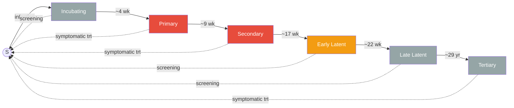

# Syphilis Progression Model

## Description

This example models the transmission, multi-stage progression, diagnosis, and
treatment of syphilis using EpiModel's network-based framework. It extends the
basic SI model by adding multiple disease compartments representing the natural
history of syphilis, plus a treatment and screening module that allows infected
individuals to recover back to the susceptible state.

This is a simplified pedagogical model intended to demonstrate how to build a
multi-stage disease model in EpiModel with stage-dependent transmission,
symptom-driven diagnosis, and population-level screening.

## Model Structure

### Disease Stages

Syphilis progresses through six stages, each represented by a named value of the
`syph.stage` attribute:

| Stage | `syph.stage` | Per-act transmission | Symptomatic | Duration (mean) |
|-------|--------------|----------------------|-------------|-----------------|
| Incubating | `"incubating"` | `inf.prob.incubating` (default 0; pre-chancre) | No | ~4 weeks |
| Primary | `"primary"` | `inf.prob.early` (0.18; chancre) | Possible | ~9 weeks |
| Secondary | `"secondary"` | `inf.prob.early` (0.18; mucous patches, condylomata) | Possible | ~17 weeks |
| Early Latent | `"early_latent"` | `inf.prob.latent` (0.09; clinical relapses) | No | ~22 weeks |
| Late Latent | `"late_latent"` | 0 (hard-coded) | No | ~29 years |
| Tertiary | `"tertiary"` | 0 (hard-coded) | Yes | Terminal |

Susceptible individuals have `syph.stage = NA` and `status = "s"`.

### Flow Diagram

Solid arrows show disease progression; dotted arrows show treatment/screening
recovery back to susceptible. Red = transmitting at the high rate
(primary/secondary, mucocutaneous lesions present); orange = transmitting at
the reduced early-latent rate; gray = not transmitting (incubating, late
latent, tertiary).

### Transmission

Stage-specific transmission probabilities are aligned with CDC's clinical
framing that sexual transmission occurs primarily through contact with
mucocutaneous syphilitic lesions, and CDC's surveillance definition of
"infectious syphilis" (primary + secondary + early non-primary non-secondary
[early latent]).

- **Primary, secondary** (`inf.prob.early` = 0.18 per act): mucocutaneous
  lesions (chancre, mucous patches, condylomata lata) present — the
  conventional route of sexual transmission.
- **Early latent** (`inf.prob.latent` = 0.09 per act): roughly half the early-
  stage rate, representing residual transmission during clinical relapses of
  secondary lesions within the first year after infection.
- **Incubating** (`inf.prob.incubating` = 0 by default): the chancre has not
  yet appeared, so the mucocutaneous-lesion transmission route is absent.
  Users can set this positive as a sensitivity analysis on pre-chancre
  transmission.
- **Late latent, tertiary**: hard-coded to zero (not sexually transmissible).

The per-partnership transmission rate uses the standard EpiModel formula:
`finalProb = 1 - (1 - transProb)^actRate`.

References: [CDC About Syphilis](https://www.cdc.gov/syphilis/about/index.html);
[CDC STI Treatment Guidelines, Syphilis](https://www.cdc.gov/std/treatment-guidelines/syphilis.htm);
Garnett GP, Aral SO, Hoyle DV, Cates W, Anderson RM (1997). *The natural
history of syphilis. Implications for the transmission dynamics and control of
infection.* Sex Transm Dis 24(4):185-200.

### Treatment Pathways

There are two routes to treatment:

1. **Symptomatic diagnosis**: Individuals who develop symptoms during the primary
   or secondary stage may seek treatment (probability `early.trt` per timestep).
   Tertiary-stage patients, who are always symptomatic, may receive treatment at
   rate `late.trt`.
2. **Population screening**: Asymptomatic infected individuals may be detected
   through routine screening (probability `scr.rate` per timestep).

Recovery times after treatment initiation:
- Primary and secondary: 1 week
- Screening-detected (all non-tertiary stages): 2 weeks
- Tertiary: 3 weeks

Upon recovery, individuals return to the susceptible state (`status = "s"`,
`syph.stage = NA`).

## Modules

### Infection module (`infect`)

Extends the built-in EpiModel infection module with stage-dependent transmission
probabilities. Also handles initialization of all custom attributes at `at == 2`
(consolidated in one place for clarity). Key custom attributes:

- `syph.stage`: current disease stage (named string or `NA` if susceptible)
- `syph.symp`: symptomatic indicator (0 or 1)
- `infTime`, `priTime`, `secTime`, `elTime`, `llTime`, `terTime`: timestamps for
  stage transitions
- `syph.trt`, `syph.scr`: treatment and screening indicators
- `trtTime`, `scrTime`: treatment and screening timestamps

### Progression module (`progress`)

Simulates transitions between syphilis stages. Each transition is a stochastic
Bernoulli process with a constant hazard rate, so time spent in each compartment
follows a geometric distribution. A minimum 1-timestep delay is enforced before
any stage transition (e.g., `infTime < at` for incubating-to-primary).

Symptomatic status is assigned stochastically at the primary and secondary stages
(probabilities `pri.sym` and `sec.sym`). Tertiary-stage individuals are always
symptomatic.

### Treatment and screening module (`tnt`)

Organized into four sequential phases:

1. **Symptomatic treatment initiation**: Symptomatic primary, secondary, and
   tertiary patients may begin treatment each timestep.
2. **Symptomatic treatment recovery**: Treated patients recover after a
   stage-dependent delay (1 week for early stages, 3 weeks for tertiary).
3. **Screening**: Asymptomatic infected individuals (only) are screened at a
   population-level rate.
4. **Screening-detected recovery**: Screened patients in non-tertiary stages
   recover after a 2-week delay.

All modified attributes (`status`, `syph.stage`, `syph.symp`, `syph.trt`,
`syph.scr`, `trtTime`, `scrTime`) are saved at the end of the function.

## Parameters

### Transmission
| Parameter | Description | Value |
|-----------|-------------|-------|
| `inf.prob.incubating` | Per-act transmission probability during incubation (pre-chancre); zero by default per CDC's mucocutaneous-lesion framing | 0 |
| `inf.prob.early` | Per-act transmission probability for primary and secondary stages (mucocutaneous lesions present) | 0.18 |
| `inf.prob.latent` | Per-act transmission probability for early latent stage (residual transmission via clinical relapses) | 0.09 |
| `act.rate` | Number of acts per partnership per timestep | 2 |

### Stage Progression
| Parameter | Description | Value |
|-----------|-------------|-------|
| `ipr.rate` | Incubating to primary transition rate | 1/4 (~4 week duration) |
| `prse.rate` | Primary to secondary transition rate | 1/9 (~9 week duration) |
| `seel.rate` | Secondary to early latent transition rate | 1/17 (~17 week duration) |
| `elll.rate` | Early latent to late latent transition rate | 1/22 (~22 week duration) |
| `llter.rate` | Late latent to tertiary transition rate | 1/1508 (~29 year duration) |

### Symptoms
| Parameter | Description | Value |
|-----------|-------------|-------|
| `pri.sym` | Probability of developing symptoms per week in primary stage | 0.205 |
| `sec.sym` | Probability of developing symptoms per week in secondary stage | 0.106 |

### Treatment and Screening
| Parameter | Description | Value |
|-----------|-------------|-------|
| `early.trt` | Weekly probability of treatment given symptoms (primary/secondary) | 0.8 |
| `late.trt` | Weekly probability of treatment given symptoms (tertiary) | 1.0 |
| `scr.rate` | Weekly probability of screening (asymptomatic infected population) | 1/52 (~yearly) |

## Output Variables

| Variable | Description |
|----------|-------------|
| `s.num`, `i.num` | Susceptible and infected counts |
| `si.flow` | New infections per timestep |
| `inc.num`, `pr.num`, `se.num`, `el.num`, `ll.num`, `ter.num` | Counts by syphilis stage |
| `sym.num` | Count of symptomatic individuals |
| `ipr.flow`, `prse.flow`, `seel.flow`, `elll.flow`, `llter.flow` | Stage transition flows |
| `rec.flow` | Total recoveries per timestep (treatment + screening) |
| `scr.flow` | New screenings per timestep |
| `scr.num`, `trt.num` | Cumulative screened and currently on treatment |
| `syph.dur`, `syph2.dur`, ..., `syph6.dur` | Mean duration in each stage |

## Next Steps

Good next steps for this example might be:

- Add vital dynamics (births and deaths) to allow endemic equilibrium
- Vary progression rates by an individual attribute (e.g., age or immune status)
- Model reinfection with partial immunity after recovery
- Add partner notification as an additional pathway to treatment

## Authors

Samuel M. Jenness, Yuan Zhao, Emeli Anderson
